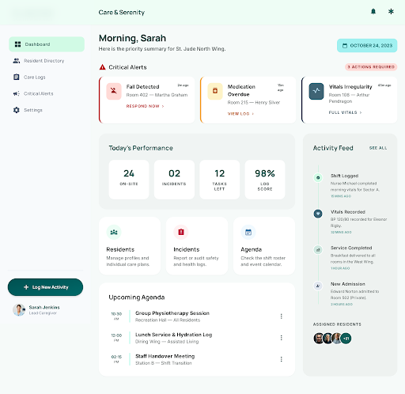
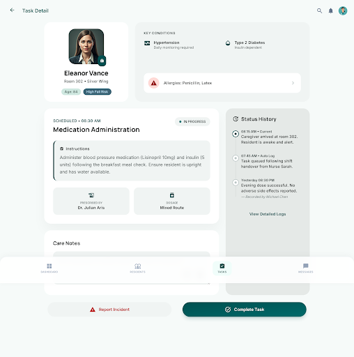
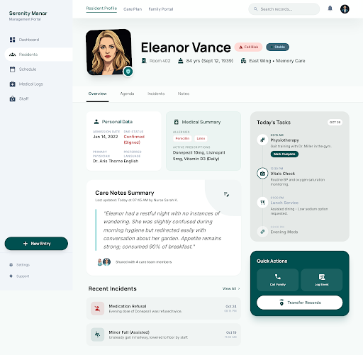
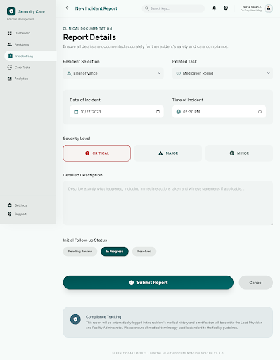
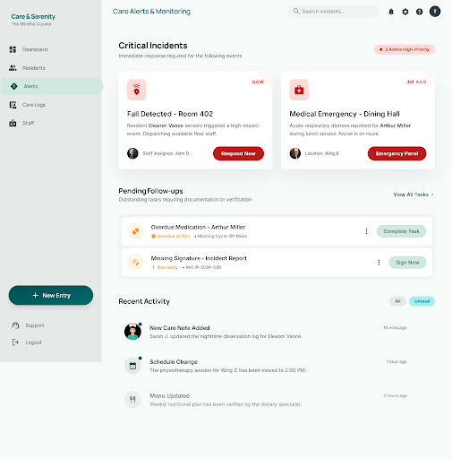

# Resumen Ejecutivo

---

## Resumen Ejecutivo

**GeroCare** es una aplicación web diseñada para digitalizar la gestión del trabajo diario en residencias de mayores. El sistema centraliza tres funcionalidades clave para el gerocultor —la agenda diaria de tareas, el acceso a las fichas de los residentes y el registro de incidencias— en una interfaz optimizada para tablet y móvil, operativa en condiciones de trabajo reales: uso táctil, redes lentas y entornos de iluminación variable.

El proyecto surge de la detección de una brecha concreta en el sector sociosanitario: la mayoría de las residencias de tamaño mediano gestionan los turnos y los cuidados con papel o herramientas genéricas (hojas de cálculo, papel impreso) que no ofrecen trazabilidad entre turnos ni alertas ante incidencias críticas. Las alternativas comerciales existentes tienen costes elevados y escasa personalización para el perfil del gerocultor.

La solución técnica se basa en una arquitectura SPA (Vue 3 + Pinia) comunicada con una API REST en Express, utilizando Firebase Authentication para la gestión de identidad y Google Firestore como base de datos NoSQL. El sistema implementa control de acceso basado en roles (RBAC) con tres perfiles: Gerocultor, Coordinador y Administrador. Los datos de los residentes, al tratarse de datos de categoría especial según el artículo 9 del RGPD (diagnósticos, alergias, medicación), están protegidos mediante cifrado en tránsito (HTTPS), reglas de seguridad de Firestore y auditoría de accesos.

El desarrollo sigue una metodología ágil por sprints, con especificación formal de requisitos (12 funcionales, 10 no funcionales) y 12 historias de usuario. La cobertura de tests incluye pruebas unitarias con Vitest, pruebas E2E con Playwright y validación automatizada de reglas de Firestore con el Emulator Suite.

El proyecto se entrega el 18 de mayo de 2026 como Trabajo de Final de Ciclo del CFS DAW en el CIPFP Batoi d'Alcoi.

---

---

---

# Introducción

---

## 1. Introducción

La gestión de turnos y tareas en residencias de mayores se realiza habitualmente con papel o aplicaciones genéricas no diseñadas para el contexto sanitario-social. Esta situación genera pérdida de trazabilidad entre turnos, errores en la administración de medicación y dificultades para coordinar al equipo de gerocultores. Los profesionales que cuidan a personas mayores en situación de dependencia merecen herramientas digitales a su altura.

Este proyecto propone el desarrollo de una aplicación web accesible desde tablet y móvil que centraliza tres funcionalidades clave para el gerocultor: la agenda diaria de tareas, el acceso a las fichas de los residentes y el registro de incidencias. El sistema está diseñado para ser usado en condiciones de trabajo reales —con guantes, en movimiento, en entornos con iluminación variable y conexiones de red lentas— por lo que la experiencia de usuario y el rendimiento en dispositivos móviles son requisitos de primer orden.

El proyecto se desarrolla como Trabajo de Final de Ciclo del Ciclo Formativo de Grado Superior en Desarrollo de Aplicaciones Web (DAW) en el CIPFP Batoi d'Alcoi, durante el curso 2025-2026. La entrega académica está fijada para el 18 de mayo de 2026. Se trata de un proyecto individual, desarrollado íntegramente por Jose Vilches Sánchez, bajo la tutela de Andres Martos Gazquez.

La solución técnica está basada en una arquitectura web moderna: Vue 3 como framework de frontend, Firebase como plataforma de autenticación y base de datos, y una API REST construida con Express que actúa como capa de negocio. Esta combinación permite un desarrollo ágil, un coste de infraestructura mínimo y una experiencia de usuario fluida en dispositivos táctiles. La elección de cada tecnología está justificada en los Registros de Decisiones de Arquitectura (ADR) incluidos en el repositorio del proyecto.

La memoria está organizada en catorce secciones: tras este capítulo introductorio, se presentan los fundamentos teóricos y tecnológicos del proyecto, el análisis de requisitos, el diseño del sistema, las fases de implementación, los resultados de las pruebas y el cumplimiento de la normativa RGPD, y finalmente las conclusiones y lecciones aprendidas.

---

---

---

# 2. Fundamentos teóricos y tecnológicos

---

## 2.1 Arquitectura SPA y el patrón cliente-servidor

Una SPA (*Single Page Application*) es una aplicación web que carga una sola página HTML y va actualizando el contenido dinámicamente sin recargar el navegador. Esto contrasta con las aplicaciones web tradicionales, donde cada acción del usuario desencadena una nueva petición al servidor y una recarga completa de la interfaz. Para una herramienta de trabajo como esta agenda digital, la diferencia es tangible: un gerocultor que actualiza el estado de una tarea en plena ronda no puede esperar a que la página se recargue, y mucho menos en redes lentas de residencias con wifi escaso.

La arquitectura que elegí sigue el modelo cliente-servidor en dos capas diferenciadas. Por un lado, el cliente es una SPA Vue 3 que corre íntegramente en el navegador del dispositivo (tablet o móvil) y se comunica con el backend a través de peticiones HTTP/REST. Por otro lado, el servidor es una API Express.js que recibe esas peticiones, aplica la lógica de negocio y consulta Cloud Firestore como base de datos. Esta separación me permite escalar o sustituir cualquiera de las dos capas de forma independiente, y facilita las pruebas unitarias de cada parte por separado. Además, al desplegar el frontend como activos estáticos en Firebase Hosting, la entrega al cliente es extremadamente rápida gracias al CDN global de Google.

---

## 2.2 Vue 3 + Composition API + Vite

Vue.js es un framework JavaScript progresivo para construir interfaces de usuario. La versión 3, lanzada en 2020, introdujo la *Composition API* (API de composición): un sistema de organización del código basado en funciones (`setup()`, `ref()`, `computed()`, `watch()`) que sustituye —o complementa— a la *Options API* clásica. La ventaja principal es que la lógica relacionada se agrupa en un mismo lugar en lugar de estar dispersa entre `data`, `methods` y `computed`, lo que facilita extraerla en composables (funciones de lógica reutilizable) independientes.

Elegí Vue 3 sobre React 18 (la opción inicial del proyecto, documentada en ADR-01 y descartada en ADR-01b) por razones prácticas: mi productividad es mayor con la Composition API que con los *hooks* de React, y el plazo académico (2026-05-18) no deja margen para curvas de aprendizaje largas. También evalué Svelte + SvelteKit: tiene un bundle (paquete compilado) más ligero y buen rendimiento, pero su ecosistema de componentes es más reducido y el riesgo de quedarme sin soluciones documentadas para requisitos específicos del proyecto era mayor. La comparativa detallada entre estas opciones se recoge en el ADR-01b del repositorio.

Como herramienta de build (*bundler*) utilizo **Vite 5+**, que aprovecha los módulos ES nativos del navegador para arrancar el servidor de desarrollo sin necesidad de empaquetar todo el proyecto cada vez. El resultado práctico es que los cambios en un componente son visibles en el navegador casi de inmediato. La configuración del proyecto se inicializó con `npm create vue@latest`, incluyendo TypeScript, Vue Router y Pinia de serie.

Para los estilos, elegí **Tailwind CSS v3**: un framework CSS de utilidades que permite aplicar estilos directamente en el HTML mediante clases predefinidas, sin necesidad de mantener archivos `.css` separados para cada componente. La ausencia de una librería de componentes prediseñada —como shadcn/ui, que sí contemplaba el stack React original— supone más trabajo en ciertos elementos de la interfaz, pero a cambio tengo control total sobre la accesibilidad y el diseño responsivo, requisitos críticos en una aplicación diseñada para tablet con posible uso con guantes.

---

## 2.3 Pinia: gestión de estado

Pinia es la librería oficial de gestión de estado para Vue 3, recomendada por el propio equipo de Vue como sustituta de Vuex. Su modelo se basa en *stores* (almacenes de estado) individuales por dominio —en mi caso `useAuthStore`, `useAgendaStore`, `useResidenteStore`— que exponen estado reactivo, *getters* (valores derivados del estado) y acciones de forma directa, sin los *mutations* que hacían Vuex verboso y difícil de seguir.

La gestión de estado es especialmente relevante en esta aplicación porque distintos componentes de la interfaz necesitan leer y actualizar los mismos datos simultáneamente: la lista de tareas de la agenda, el residente activo en la ficha, o el token de autenticación del gerocultor en sesión. Con Pinia, cualquier componente puede importar el store correspondiente y acceder a sus datos reactivos sin necesidad de *prop drilling* (pasar datos a través de múltiples niveles de componentes) ni eventos de bus global. Respecto a Redux/Zustand del ecosistema React, Pinia tiene menos *boilerplate* (código repetitivo), TypeScript integrado y las DevTools de Vue disponibles automáticamente; sin embargo, Redux tiene un ecosistema middleware más maduro para flujos asíncronos complejos, que en este proyecto no son necesarios.

---

## 2.4 Firebase: Firestore, Authentication y Hosting

### Firestore como base de datos

Cloud Firestore es una base de datos NoSQL (*Not Only SQL*, no relacional) orientada a documentos, gestionada como servicio en la nube por Google. En lugar de tablas y filas, Firestore organiza los datos en colecciones de documentos JSON anidables. Para este proyecto, cada entidad del dominio (residentes, tareas, incidencias, usuarios, turnos) se mapea directamente a una colección de nivel superior, siguiendo el modelo definido en `SPEC/entities.md`.

La elección de Firestore sobre PostgreSQL (la opción original con Supabase, descartada en ADR-02b) responde a dos razones principales. Primera, coherencia de ecosistema: al usar Firebase Auth y Firebase Hosting, concentrar también la base de datos en el mismo proveedor elimina la necesidad de gestionar credenciales, regiones y consolas de múltiples servicios. Segunda, velocidad de implementación: para un proyecto individual con plazo ajustado, evitar la configuración de PostgreSQL, migraciones SQL y un ORM supuso un ahorro de tiempo significativo. Como contrapartida, Firestore introduce complejidad en consultas relacionales —los *joins* no existen: hay que desnormalizar los datos o hacer consultas múltiples— y genera dependencia del proveedor Google (*vendor lock-in*). Este tradeoff (compensación entre ventajas e inconvenientes) está documentado en ADR-02b.

Una ventaja concreta de Firestore para esta aplicación es su soporte nativo de *listeners* en tiempo real: si un coordinador actualiza el estado de una tarea, el cambio puede propagarse automáticamente a la vista del gerocultor sin necesidad de polling. Esto abre la puerta a funcionalidades de tiempo real sin arquitectura adicional.

En cuanto al cumplimiento del RGPD, configuro el proyecto Firebase con la localización de Firestore en la región `europe-west1` (Bélgica) o `europe-west3` (Frankfurt) para asegurar que los datos permanecen en la Unión Europea. Este aspecto se desarrolla en detalle en la sección 10.

### Firebase Authentication

Firebase Auth es el servicio de autenticación de Firebase. Gestiona el ciclo completo de identidad: registro, inicio de sesión, recuperación de contraseña, y emisión de tokens JWT (*JSON Web Token*, estándar para autenticación sin estado) que el cliente puede usar para autenticarse en la API Express. Elegí Firebase Auth sobre las alternativas por dos razones concretas. Primero, evita implementar manualmente la gestión de JWT: generación, firma, expiración y *refresh* (renovación del token) son responsabilidad del SDK, no mía. Segundo, es coherente con el resto del ecosistema Firebase: el mismo proyecto, la misma consola, las mismas credenciales de administración.

Descarté Auth0 (servicio externo de autenticación) porque añadiría un tercer proveedor de pago con un plan gratuito limitado. Descarté también implementar JWT propio con Express porque requeriría entre 3 y 5 días de desarrollo adicional y conlleva riesgo real de errores de seguridad en una aplicación que maneja datos de salud. El desglose de estas alternativas está en ADR-03b.

El modelo de seguridad que implementé tiene tres capas: Firebase Auth valida la identidad del usuario; las *Firestore Security Rules* controlan qué documentos puede leer o escribir cada rol en acceso directo; y el middleware Express verifica el ID token en cada petición a la API y comprueba los *custom claims* de rol (`gerocultor`, `coordinador`, `administrador`). Esta arquitectura de defensa en profundidad es especialmente importante porque los datos del sistema incluyen diagnósticos, medicación e incidencias de salud de los residentes: datos de categoría especial según el artículo 9 del RGPD.

### Firebase Hosting

Firebase Hosting es el servicio de alojamiento de activos estáticos de Firebase. Despliega la SPA Vue compilada en un CDN (*Content Delivery Network*, red de distribución de contenido global) con HTTPS automático, sin necesidad de configurar servidores ni certificados. El comando `firebase deploy` empaqueta en un solo paso el frontend, las Firestore Rules y las configuraciones del proyecto.

Evalué otras opciones: Vercel y Netlify ofrecen previews automáticos de *pull requests* y despliegues rápidos, pero requieren un segundo proveedor desconectado de Firebase, con más fricción operativa. Google Cloud Run permitiría desplegar también la API Express en contenedores, pero implica Dockerfile, CI/CD más complejo y coste por invocación que excede el plan gratuito para un proyecto académico. La decisión y su justificación completa están en ADR-04b.

---

## 2.5 Express.js como capa API intermedia

Express.js es un framework minimalista para construir servidores HTTP con Node.js. En este proyecto cumple el rol de *API wrapper*: recibe las peticiones del cliente Vue, verifica la autenticación (middleware `verifyAuth` con Firebase Admin SDK), aplica la lógica de negocio que no puede expresarse solo en Firestore Rules, y ejecuta las operaciones en Firestore a través del Admin SDK.

La capa Express es necesaria en dos escenarios principales. Primero, en operaciones que requieren comprobaciones cruzadas entre colecciones: por ejemplo, verificar que un gerocultor tiene asignado el residente que intenta consultar requiere cruzar la colección `residenteAsignaciones` antes de servir el documento de `residentes`. Esto no es posible directamente en Firestore Rules. Segundo, en la gestión de los *custom claims* de rol: asignar o modificar el claim `rol` de un usuario solo puede hacerse desde el Admin SDK (backend), nunca desde el cliente.

La arquitectura interna de la API sigue la estructura `api/{routes, controllers, middleware, services}`, donde cada capa tiene una responsabilidad única. El *middleware* solo verifica tokens; los *controllers* orquestan la petición; los *services* encapsulan la lógica de negocio; las *routes* definen los endpoints.

---

## 2.6 Diseño Mobile-first y accesibilidad (WCAG 2.1 AA)

El diseño *mobile-first* (móvil primero) es una metodología que parte del diseño para la pantalla más pequeña (generalmente móvil) y escala progresivamente hacia pantallas más grandes, en lugar del enfoque inverso. Para esta aplicación es la opción natural: los gerocultores trabajan con tablets de 10 pulgadas o móviles durante sus rondas, a menudo con guantes, en entornos con luz variable. El diseño debe funcionar correctamente en esas condiciones desde el principio.

La implementación de *mobile-first* en Tailwind CSS es directa: sus clases responsivas usan prefijos (`sm:`, `md:`, `lg:`) que aplican estilos a partir de cierto ancho de pantalla, forzando a diseñar el layout (composición visual) base para pantallas pequeñas.

Respecto a la accesibilidad, el proyecto sigue las pautas WCAG 2.1 nivel AA (*Web Content Accessibility Guidelines*, Pautas de Accesibilidad para el Contenido Web). Este estándar del W3C define tres niveles de conformidad (A, AA, AAA); el nivel AA es el objetivo habitual en proyectos profesionales y el requerido por la normativa europea de accesibilidad digital. Implica garantizar contraste mínimo de 4,5:1 en texto normal, proporcionar etiquetas `aria-*` en elementos interactivos, asegurar navegación completa por teclado, y que las áreas pulsables sean suficientemente grandes para uso táctil (mínimo 44×44 px). Estas exigencias son relevantes en una residencia donde el personal puede tener distintos perfiles de visión y movilidad.

Para el proceso de diseño de pantallas utilicé **Google Stitch** (ADR-05), una herramienta de prototipado asistida por IA integrada en el flujo de trabajo con agentes MCP. Los exports de pantallas se versionan en `OUTPUTS/design-exports/` siguiendo la convención de nombres definida en ADR-05.

---

## 2.7 Metodología: Spec-Driven Development (SDD) y ciclo ágil

El desarrollo del proyecto sigue una metodología ágil con sprints semanales de 5-7 días. La planificación parte del backlog definido en `PLAN/backlog.md`, priorizado con criterios MoSCoW (Must/Should/Could/Won't), y se trabaja un sprint a la vez documentado en `PLAN/current-sprint.md`.

Dentro de este ciclo ágil, adopté **Spec-Driven Development (SDD)** como metodología de trabajo con agentes de IA. SDD propone escribir las especificaciones, decisiones de diseño y tareas de implementación en artefactos estructurados antes de escribir código, de modo que los agentes tengan contexto suficiente para producir código coherente con los requisitos. Los guardrails del proyecto (G01-G09, en `AGENTS/guardrails.md`) formalizan este enfoque: ningún agente puede escribir código sin una historia de usuario en `SPEC/`, y ninguna decisión técnica relevante avanza sin un ADR en `DECISIONS/`. Esta disciplina, aunque añade fricción inicial, reduce significativamente la deuda técnica y las inconsistencias entre capas en un proyecto de desarrollo individual.

---

---

# 3. Contexto y organización del proyecto

---

## 3.1 El sector sociosanitario en España

Las residencias de mayores son uno de los pilares del sistema de cuidados de larga duración en España. Según datos del IMSERSO (2023) [CITA PENDIENTE], existen aproximadamente 5.400 centros residenciales para personas mayores en el territorio nacional, con más de 380.000 plazas en funcionamiento. Este sector atiende a personas en situación de dependencia severa o moderada que requieren cuidados continuados durante las veinticuatro horas del día, repartidos en turnos de mañana, tarde y noche.

La presión asistencial en estos centros es alta: cada gerocultor puede tener bajo su responsabilidad entre seis y quince residentes en un mismo turno, con tareas que abarcan desde la higiene personal y la administración de medicación hasta la supervisión del estado de salud y la detección de incidencias. La correcta comunicación entre turnos y el registro de cualquier evento relevante son, en este contexto, cuestiones de seguridad clínica y no meramente administrativas.

## 3.2 El rol del gerocultor: responsabilidades, turnos y registro

El gerocultor —también denominado auxiliar de gerontología o técnico en atención sociosanitaria— es el profesional de atención directa en la residencia. Su jornada se estructura en turnos rotativos (mañana, tarde y noche) y su trabajo incluye, entre otras responsabilidades: ejecutar los cuidados de higiene y movilización de los residentes asignados, administrar la medicación pautada, registrar cualquier incidencia observada durante el turno y garantizar el traspaso de información al equipo del turno siguiente.

En la gran mayoría de centros, este registro se realiza todavía con papel: hojas de turno, cuadernos de incidencias y fichas individuales en formato físico. Cuando el gerocultor necesita conocer el estado de salud de un residente —sus alergias, su medicación activa, sus últimas incidencias— debe localizar la carpeta correspondiente, hojearla y retenerla de memoria antes de prestar la atención. Este proceso, además de lento, introduce margen de error en un entorno donde los datos de salud son críticos.

## 3.3 Problema identificado: falta de digitalización y trazabilidad

La ausencia de una herramienta digital centralizada genera tres problemas concretos que este proyecto busca resolver. Primero, la pérdida de información en el traspaso de turno: cuando el gerocultor del turno de mañana termina y el de la tarde comienza, las incidencias registradas en papel pueden extraviarse, quedar ilegibles o simplemente no leerse antes de la atención. Segundo, el riesgo de error en la administración de cuidados: sin acceso inmediato a la ficha del residente, un gerocultor puede desconocer una alergia reciente o un cambio en la pauta de medicación. Tercero, la trazabilidad nula: ante cualquier reclamación o auditoría, resulta muy difícil reconstruir quién atendió a quién, cuándo y en qué condiciones.

La digitalización de este flujo no requiere complejidad tecnológica excesiva; requiere una interfaz pensada para el entorno real de uso: pantalla táctil, guantes puestos, iluminación variable, conexión a internet de calidad modesta.

## 3.4 Alcance del proyecto: MVP y lo que queda fuera

El MVP de este proyecto cubre las funcionalidades más críticas del día a día del gerocultor, correspondientes a los requisitos RF-01 a RF-07. He priorizado estas siete funcionalidades porque representan el núcleo del flujo de trabajo: iniciar sesión con credenciales seguras (RF-01), acceder solo a los datos que corresponden a su rol (RF-02), consultar su agenda diaria (RF-03), actualizar el estado de sus tareas (RF-04), consultar la ficha del residente (RF-05), registrar incidencias con un formulario rápido de cinco taps (RF-06) y consultar el historial de incidencias de cada residente (RF-07).

Quedan fuera del MVP —pero documentadas como funcionalidades Should y Could— las notificaciones in-app de alertas críticas (RF-08), la gestión de residentes por el coordinador (RF-09), la gestión de cuentas de usuario por el administrador (RF-10), el resumen y traspaso de turno estructurado (RF-11) y la vista de agenda semanal (RF-12). La decisión de excluirlas del MVP no responde a su falta de importancia, sino a la limitación de tiempo de un proyecto académico individual con fecha de entrega fija. El modo offline, las notificaciones push nativas del sistema operativo, la aplicación nativa y el portal para familiares quedan explícitamente fuera del alcance de este proyecto.

---

---

# 4. Análisis de requisitos

---

## 4.1 Metodología de captura de requisitos

La captura de requisitos se realizó mediante un proceso iterativo en dos fases. En la primera fase, utilicé una entrevista estructurada con el agente COLLECTOR —un rol de IA entrenado para extraer requisitos del dominio— a partir de la propuesta de proyecto aprobada (Jose Vilches Sánchez, 27 de febrero de 2026). El COLLECTOR documentó los resultados en `LOGS/raw_requirements_*.md` sin interpretar ni decidir, garantizando que la fuente primaria quedara intacta.

En la segunda fase, los requisitos en bruto fueron formalizados y estructurados en `SPEC/requirements.md` y `SPEC/user-stories.md`. Durante este proceso distinguí entre requisitos explícitos en la propuesta y requisitos inferidos del dominio (marcados como `[INFERRED]`), que son necesarios por las características propias de cualquier sistema con datos sanitarios y control de acceso por roles. La revisión final de los requisitos se realizó en diálogo con el tutor del proyecto, Andres Martos Gazquez, garantizando la coherencia con los objetivos académicos del ciclo DAW.

## 4.2 Actores del sistema

El sistema gestiona tres tipos de usuario con permisos diferenciados:

| Actor | Descripción | Historias de usuario asociadas |
|-------|-------------|-------------------------------|
| **Gerocultor** | Personal de atención directa. Trabaja en turnos rotativos (mañana, tarde, noche). Accede a su agenda personal, a los residentes que tiene asignados y puede registrar incidencias. | US-01, US-03, US-04, US-05, US-06, US-07, US-08, US-11, US-12 |
| **Coordinador** | Responsable de planta o de turno. Supervisa al equipo de gerocultores. Tiene acceso de lectura a todas las agendas y puede gestionar fichas de residentes. | US-01, US-02, US-05, US-07, US-09, US-11, US-12 |
| **Administrador** | Gestor del sistema (director del centro o responsable de TI). Controla la creación y desactivación de cuentas y la asignación de residentes a gerocultores. | US-02, US-10 |

## 4.3 Requisitos funcionales

Los siguientes requisitos definen qué debe hacer el sistema. La prioridad MoSCoW indica el impacto de cada requisito en la viabilidad del MVP:

| ID | Nombre | Descripción | Actor | Prioridad |
|----|--------|-------------|-------|-----------|
| RF-01 | Autenticación de usuarios | El sistema permite iniciar y cerrar sesión con credenciales seguras (email/contraseña). | Gerocultor, Coordinador, Administrador | **Must** |
| RF-02 | Gestión de roles y permisos | El sistema soporta tres roles (Gerocultor, Coordinador, Administrador) con permisos diferenciados a nivel de acción y de datos. | Sistema, Administrador | **Must** |
| RF-03 | Consulta de agenda diaria | El gerocultor consulta su agenda del día actual: tareas ordenadas por hora, con estado, residente asociado y notas. | Gerocultor | **Must** |
| RF-04 | Completar / actualizar tarea | El gerocultor marca tareas como completadas, en curso o con incidencia, y añade notas libres. | Gerocultor | **Must** |
| RF-05 | Consulta de ficha de residente | El gerocultor accede a la ficha del residente asignado: datos identificativos, diagnósticos, alergias, medicación y preferencias de cuidado. Solo lectura para gerocultor; editable por coordinador. | Gerocultor, Coordinador | **Must** |
| RF-06 | Registro de incidencia | El gerocultor registra una incidencia: tipo, descripción, severidad y marca de tiempo automática del servidor. La incidencia es inmutable post-creación. | Gerocultor | **Must** |
| RF-07 | Historial de incidencias | Listado de incidencias por residente, paginado, filtrable por fecha y tipo. | Gerocultor, Coordinador | **Must** |
| RF-08 | Notificaciones y alertas críticas | El sistema envía notificaciones in-app al gerocultor cuando se registra una incidencia crítica o una tarea está próxima. | Sistema, Gerocultor | **Should** |
| RF-09 | Gestión de residentes | El coordinador/administrador crea, edita y da de baja residentes. El alta activa la ficha y la posibilidad de asignar tareas. | Coordinador, Administrador | **Should** |
| RF-10 | Gestión de usuarios | El administrador crea y desactiva cuentas de gerocultores y coordinadores, y asigna residentes. | Administrador | **Should** |
| RF-11 | Resumen y traspaso de turno | El gerocultor genera un resumen al fin del turno con tareas completadas, pendientes e incidencias registradas. | Gerocultor | **Should** |
| RF-12 | Vista de agenda semanal | Vista de la agenda de la semana en curso para planificar o revisar la distribución de tareas. | Gerocultor, Coordinador | **Could** |

## 4.4 Requisitos no funcionales

Los requisitos no funcionales definen las restricciones de calidad del sistema:

| ID | Nombre | Descripción | Criterio de aceptación |
|----|--------|-------------|------------------------|
| RNF-01 | Diseño tablet-first y mobile-first | Interfaz optimizada para tablets (768–1024 px) y móviles (< 768 px). Touch targets mínimos de 44×44 px. | Usable con el dedo en tablet de 10" y móvil de 5,5" sin necesidad de zoom. |
| RNF-02 | Rendimiento en redes lentas | Carga inicial funcional en conexión 3G lento (~400 Kbps). Tiempo de carga ≤ 5 segundos en esas condiciones. | Lighthouse Performance score ≥ 70 en simulación "Slow 3G". |
| RNF-03 | Seguridad de datos (RGPD) | Transmisión cifrada (HTTPS). Datos de salud accesibles solo con autenticación y rol adecuado. Sin datos sensibles en texto plano en el cliente. | Ninguna ruta API devuelve datos de residentes sin token válido. Accesos no autorizados retornan HTTP 401/403. |
| RNF-04 | Disponibilidad y tiempo de respuesta | Operaciones principales (carga de agenda, registro de incidencia) en menos de 2 segundos en condiciones normales. | Tests de rendimiento: respuesta < 2 s en el 95% de peticiones bajo carga normal. |
| RNF-05 | Accesibilidad WCAG 2.1 nivel AA | Contraste mínimo 4.5:1 para texto normal. Navegable con tecnologías de asistencia básicas. | Lighthouse Accessibility score ≥ 85. |
| RNF-06 | Escalabilidad básica | Soporte para al menos 20 usuarios concurrentes sin degradación significativa. | Tests de carga: 20 usuarios concurrentes sin superar 3 s de respuesta media. |
| RNF-07 | Trazabilidad y auditoría | Todas las operaciones sobre datos de residentes quedan registradas con usuario, timestamp y acción. | Registro de auditoría en base de datos, no modificable por el gerocultor. |
| RNF-08 | Mantenibilidad del código | Código sigue convenciones de TECH_GUIDE.md. Linting configurado. Cobertura de tests ≥ 60% en lógica de negocio. | Pipeline CI sin fallos de linting. Cobertura ≥ 60%. |
| RNF-09 | Seguridad con Firestore Rules | Acceso directo a Firestore desde el cliente bloqueado o estrictamente limitado mediante Firebase Security Rules. | Suite de tests automatizados para las reglas de Firestore que valida accesos permitidos y denegados por rol. |
| RNF-10 | PWA excluido del alcance | Las capacidades PWA y el funcionamiento offline quedan explícitamente fuera del alcance para garantizar la entrega en plazo. | La aplicación requiere conexión a internet. No se implementan Service Workers para caché offline. |

## 4.5 Historias de usuario

Las historias de usuario formalizan los requisitos desde el punto de vista del actor. A continuación se presentan las doce historias, con los criterios de aceptación completos de las tres más críticas para el flujo del gerocultor.

---

**US-01 — Inicio de sesión**
*Como gerocultor o coordinador, quiero iniciar sesión con mis credenciales, para acceder a mi agenda y los datos de los residentes de forma segura.*

**Criterios de aceptación (completos)**:
- CA-1: El formulario de login muestra campos de usuario y contraseña.
- CA-2: Con credenciales incorrectas, el sistema muestra un mensaje de error claro sin revelar qué campo es incorrecto.
- CA-3: Con credenciales correctas, el usuario es redirigido a su agenda del día.
- CA-4: La sesión persiste utilizando el SDK de Firebase Auth, manejando el ciclo de vida del token de forma automática.
- CA-5: El botón de cerrar sesión invalida el token en el servidor.

---

**US-02 — Control de acceso por rol**
*Como administrador, quiero que cada usuario solo acceda a las funciones y datos que corresponden a su rol, para proteger la privacidad de los residentes y mantener la integridad del sistema.*

**US-03 — Consulta de agenda diaria**
*Como gerocultor, quiero ver mi agenda del día actual al iniciar sesión, para saber qué tareas tengo pendientes, en qué orden y para qué residente.*

**Criterios de aceptación (completos)**:
- CA-1: La agenda muestra todas las tareas del día, ordenadas cronológicamente.
- CA-2: Cada tarea muestra: hora, nombre del residente, tipo de tarea y estado (pendiente / en curso / completada).
- CA-3: Las tareas vencidas y no completadas se resaltan visualmente.
- CA-4: La vista es usable en tablet (10") con interacción táctil.
- CA-5: La agenda carga en menos de 2 segundos.

---

**US-04 — Actualizar estado de una tarea**
*Como gerocultor, quiero marcar una tarea como completada o añadir notas, para registrar lo que he hecho y avisar al siguiente turno.*

**US-05 — Consulta de ficha de residente**
*Como gerocultor, quiero acceder a la ficha de un residente desde su tarea o desde una búsqueda, para recordar sus condiciones de salud, alergias y preferencias antes de atenderle.*

**US-06 — Registro de incidencia**
*Como gerocultor, quiero registrar una incidencia de un residente con un formulario rápido, para que quede constancia inmediata y el equipo pueda actuar.*

**Criterios de aceptación (completos)**:
- CA-1: El formulario permite seleccionar el residente, tipo de incidencia, severidad (leve / moderada / crítica) y descripción libre.
- CA-2: La fecha y hora se registran automáticamente (servidor, no cliente).
- CA-3: El usuario que registra la incidencia queda identificado automáticamente.
- CA-4: Al guardar, la incidencia aparece inmediatamente en el historial del residente.
- CA-5: Si la severidad es "crítica", se dispara una notificación al coordinador.
- CA-6: El formulario se puede completar con 5 taps o menos en tablet.

---

**US-07 — Historial de incidencias de un residente**
*Como gerocultor o coordinador, quiero consultar el historial de incidencias de un residente filtrado por fecha y tipo, para evaluar su evolución y detectar patrones.*

**US-08 — Recibir notificaciones de alertas críticas** *(Should)*
*Como gerocultor, quiero recibir notificaciones cuando haya una incidencia crítica o una tarea urgente, para reaccionar a tiempo sin tener que estar revisando la app constantemente.*

**US-09 — Alta y gestión de residentes** *(Should)*
*Como coordinador, quiero dar de alta nuevos residentes y editar sus fichas, para mantener actualizado el registro de personas atendidas.*

**US-10 — Gestión de cuentas de usuarios** *(Should)*
*Como administrador, quiero crear y desactivar cuentas de gerocultores y coordinadores, para controlar quién tiene acceso al sistema.*

**US-11 — Resumen de fin de turno** *(Should)*
*Como gerocultor, quiero generar un resumen de mi turno al terminarlo, para facilitar el traspaso al compañero del turno siguiente.*

**US-12 — Vista de agenda semanal** *(Could)*
*Como gerocultor o coordinador, quiero ver la agenda de la semana en una vista de calendario, para planificar y revisar la distribución de tareas.*

---

---

# 5. Diseño del sistema

---

## 5.1 Arquitectura general

El sistema sigue una arquitectura de tres capas, separando de forma clara la presentación, la lógica de negocio y el almacenamiento de datos. Esta separación facilita el mantenimiento, la escalabilidad y la seguridad del proyecto.

La capa de **presentación** está formada por una SPA (*Single Page Application*) desarrollada con Vue 3 y compilada con Vite. Ejecuta en el navegador del dispositivo del usuario —tablet o móvil— y se comunica con el backend a través de peticiones HTTP. La elección de una SPA permite que la aplicación responda de forma ágil a la interacción táctil sin recargar la página completa, algo esencial para el entorno de trabajo de los gerocultores.

La capa de **lógica de negocio y autenticación** combina dos elementos: Firebase Auth para la gestión de identidades y una API REST ligera construida con Express.js (Node.js). Firebase Auth emite tokens JWT (*JSON Web Tokens*) que la API verifica en cada petición mediante el Firebase Admin SDK. La API es responsable de las operaciones que requieren lógica de servidor —por ejemplo, comprobar si un gerocultor tiene asignado un residente antes de devolver su ficha clínica.

La capa de **almacenamiento** utiliza Firestore, la base de datos documental en tiempo real de Firebase. Los datos se organizan en colecciones de documentos JSON, con Firestore Security Rules que impiden el acceso directo no autorizado incluso si alguien intentara saltarse la API.

```
┌─────────────────────────────────────────────────┐
│              Dispositivo del usuario             │
│   Vue 3 SPA (Vite + Pinia + Axios + Tailwind)   │
└──────────────────────┬──────────────────────────┘
                       │ HTTPS / REST
┌──────────────────────▼──────────────────────────┐
│                  Firebase Auth                   │
│          (Autenticación — JWT / ID Token)        │
└──────────────────────┬──────────────────────────┘
                       │ Bearer Token
┌──────────────────────▼──────────────────────────┐
│              API REST — Express.js               │
│  Middleware verifyAuth → lógica de negocio       │
└──────────────────────┬──────────────────────────┘
                       │ Firebase Admin SDK
┌──────────────────────▼──────────────────────────┐
│                   Firestore                      │
│  (Base de datos NoSQL — Firebase Security Rules) │
└─────────────────────────────────────────────────┘
```

*Figura 1 — Diagrama de arquitectura por capas del sistema. Elaboración propia.*

Esta arquitectura desacoplada permite que, si en el futuro fuera necesario cambiar el proveedor de base de datos, solo la capa de acceso a datos de la API requeriría modificaciones, sin impacto en el frontend.

---

## 5.2 Modelo de datos

El sistema gestiona siete entidades principales. A continuación describo cada una de ellas con sus atributos más relevantes y las relaciones que mantienen entre sí.

### Usuario

Representa a cualquier persona con acceso al sistema: gerocultor, coordinador o administrador. Los campos clave son `email` (utilizado como login, único en todo el sistema), `rol` (que determina los permisos) y `activo` (que permite desactivar una cuenta sin eliminar sus registros históricos). El campo `passwordHash` se almacena como hash bcrypt y nunca se devuelve al cliente.

### Residente

Representa a la persona mayor que vive en la residencia y recibe los cuidados. Contiene los datos identificativos básicos y varios campos de categoría especial según el RGPD (art. 9): `diagnosticos`, `alergias`, `medicacion` y `preferencias`. Estos campos solo son accesibles por usuarios autenticados con el rol apropiado. El campo `archivado` permite dar de baja a un residente sin eliminar su historial clínico.

### Tarea

Representa una actividad programada en la agenda de un gerocultor para un residente concreto (por ejemplo, administración de medicación a las 08:00). Su campo `estado` sigue un ciclo definido: `pendiente → en_curso → completada` (o `con_incidencia`). Al marcarse como completada, el sistema registra automáticamente la hora exacta en `completadaEn`.

### Incidencia

Representa un evento registrado durante la atención a un residente (caída, problema de salud, comportamiento, etc.). Las incidencias son **inmutables**: una vez creadas, no se pueden editar ni eliminar, garantizando la trazabilidad del historial clínico. Si la `severidad` es `critica`, el sistema genera automáticamente una notificación al coordinador.

### Turno

Representa el turno de trabajo de un gerocultor. Al finalizar el turno, el sistema genera un resumen de traspaso (`resumenTraspaso`) con las tareas completadas, las pendientes y las incidencias registradas durante ese período.

### Notificacion

Almacena los avisos generados automáticamente por el sistema para un usuario concreto. No puede ser creada directamente por el usuario: solo el sistema la genera en respuesta a eventos (incidencia crítica, tarea próxima, traspaso de turno). El usuario solo puede marcarla como leída.

### ResidenteAsignacion

Tabla de unión que relaciona gerocultores con los residentes que tienen asignados. Un gerocultor solo puede ver y actuar sobre los residentes que figuran en sus asignaciones activas. Esta restricción se aplica tanto en la API como en las Firestore Security Rules.

---

## 5.3 Diagrama entidad-relación

La siguiente figura muestra las relaciones entre entidades. Las líneas con notación `1` y `N` indican la cardinalidad de cada relación.

```
Usuario (1) ──────────────────── (N) ResidenteAsignacion (N) ──── (1) Residente
   │                                                                       │
   │ (1)                                                                   │ (1)
   ├──────── (N) Tarea ─────────────────────────────────────────────────── ┤
   │                                                                       │
   ├──────── (N) Incidencia ──────────────────────────────────────────────── ┤
   │                                                                       │
   └──────── (N) Turno                                                     │
                                                                           │
Notificacion (N) ─────── (1) Usuario                                      │
                                                                           │
Incidencia (N) ─── (0..1) Tarea                                           │
```

*Figura 2 — Diagrama entidad-relación del modelo de datos. Elaboración propia.*

Una decisión de diseño importante es que `Incidencia` puede estar vinculada opcionalmente a una `Tarea` (cuando el gerocultor marca una tarea como "con incidencia"), pero también puede crearse de forma independiente desde la ficha del residente. Esto da flexibilidad sin romper la integridad del modelo.

---

## 5.4 Estructura de colecciones en Firestore

Firestore organiza los datos en colecciones de documentos JSON. A diferencia de una base de datos relacional, no existen tablas con filas: cada documento es un objeto independiente con sus propios campos. Las relaciones se implementan mediante IDs de referencia o subcolecciones.

Para este sistema, la estructura de colecciones es la siguiente:

| Colección raíz | Descripción |
|----------------|-------------|
| `/usuarios` | Un documento por usuario (gerocultor, coordinador, admin) |
| `/residentes` | Un documento por residente. Subcol. `/residentes/{id}/tareas` e `/residentes/{id}/incidencias` |
| `/turnos` | Un documento por turno de trabajo |
| `/notificaciones` | Un documento por notificación generada |

Las `Tarea` e `Incidencia` se almacenan como subcolecciones dentro del documento del residente al que pertenecen. Esta estructura facilita las consultas más habituales ("todas las tareas de hoy para el residente X") y simplifica las reglas de seguridad: si un usuario no tiene acceso al documento padre (`residente`), tampoco puede acceder a sus subcolecciones.

Las asignaciones gerocultor-residente se implementan como un array de IDs de usuario (`gerocultoresAsignados`) dentro del documento del residente, lo que permite a las Firestore Rules verificar directamente si el usuario autenticado está en esa lista.

---

## 5.5 Diseño de la API REST

La API REST actúa como capa intermedia entre el frontend y Firestore cuando la lógica de negocio requiere validaciones que no se pueden expresar en las Firestore Rules. Todos los endpoints exigen un token de autenticación válido en la cabecera `Authorization: Bearer {idToken}`, salvo el endpoint de verificación de disponibilidad (`GET /health`).

Los endpoints principales son los siguientes:

| Método | Ruta | Descripción | Rol mínimo |
|--------|------|-------------|-----------|
| `GET` | `/health` | Verificación de disponibilidad | Público |
| `POST` | `/auth/login` | Inicio de sesión (delega en Firebase Auth) | Público |
| `GET` | `/api/residents` | Lista de residentes asignados al usuario autenticado | Gerocultor |
| `GET` | `/api/residents/:id` | Ficha completa de un residente (incluye datos sensibles) | Gerocultor asignado |
| `POST` | `/api/incidents` | Registro de una nueva incidencia | Gerocultor |
| `GET` | `/api/incidents?residenteId=:id` | Historial de incidencias de un residente | Gerocultor asignado |
| `PATCH` | `/api/tasks/:id` | Actualizar estado de una tarea | Gerocultor asignado |

Un ejemplo de petición y respuesta para el registro de incidencia (`POST /api/incidents`):

```json
// Request body
{
  "tipo": "caida",
  "severidad": "moderada",
  "descripcion": "El residente tropezó en el pasillo durante el paseo de las 10:00",
  "residenteId": "res-123",
  "tareaId": null
}

// Response 201
{
  "data": {
    "id": "inc-456",
    "tipo": "caida",
    "severidad": "moderada",
    "registradaEn": "2026-04-06T10:15:32Z",
    "usuarioId": "usr-789"
  }
}
```

El timestamp `registradaEn` lo genera el servidor, no el cliente. Esto es un requisito de seguridad: si permitiéramos que el cliente enviara la fecha, un usuario podría antedatar incidencias y alterar el historial clínico.

---

## 5.6 Diseño UX: flujos de usuario principales

El sistema define seis flujos de usuario (FL-01 a FL-06) que cubren las operaciones más frecuentes del gerocultor. Estos flujos guiaron el diseño de las pantallas y sirvieron como base para los wireframes.

**FL-01 — Inicio de sesión**: El gerocultor introduce su email y contraseña. El sistema los valida contra Firebase Auth. Si son correctos, recibe un token JWT y se le redirige a su agenda del día. Si son incorrectos, el mensaje de error es genérico ("Usuario o contraseña incorrectos") para no revelar qué campo falló.

**FL-02 — Consulta de agenda diaria**: Al acceder, el sistema recupera automáticamente todas las tareas del día del gerocultor, ordenadas cronológicamente. Cada tarea muestra la hora, el nombre del residente, el tipo de cuidado y el estado con código de color (verde = completada, naranja = en curso, rojo = vencida y pendiente).

**FL-03 — Registro de incidencia**: El gerocultor puede registrar una incidencia desde la agenda, desde la ficha del residente o al marcar una tarea con estado "con incidencia". El formulario está optimizado para completarse en cinco pasos táctiles o menos (requisito US-06).

**FL-04 — Consulta del historial de incidencias**: Desde la ficha de un residente, el coordinador o el gerocultor asignado puede consultar el historial completo con filtros por fecha y tipo.

**FL-05 — Actualización de estado de tarea**: Al pulsar una tarea, aparece un panel de acción con las opciones disponibles. El estado actualizado se refleja de forma inmediata en la agenda mediante optimistic update (la UI se actualiza antes de que el servidor confirme, mejorando la percepción de velocidad).

**FL-06 — Cierre de turno**: Al finalizar su turno, el gerocultor confirma el cierre y el sistema genera automáticamente el resumen de traspaso, que queda disponible para el coordinador y el turno siguiente.

---

## 5.7 Prototipo y diseño de pantallas

Las pantallas principales del sistema se diseñaron usando Stitch (Google), una herramienta de prototipado que permite generar propuestas visuales rápidas. Los prototipos sirvieron para validar la distribución de elementos antes de empezar la implementación y para verificar que los flujos definidos en la especificación eran realizables en la interfaz.

A continuación se muestran las capturas de las pantallas más representativas del sistema:

**Figura 1 — Pantalla de inicio de sesión (US-01)**


*Figura 1 — Pantalla de inicio de sesión. Muestra el formulario con email y contraseña y el botón de acceso. El diseño es limpio y centrado, optimizado para pantallas de tablet. Fuente: Elaboración propia / Stitch.*

---

**Figura 2 — Dashboard del gerocultor (US-03)**



*Figura 2 — Dashboard del gerocultor. Lista de tareas del día ordenadas por hora con código de colores (verde = completada, naranja = en curso, rojo = vencida). Fuente: Elaboración propia / Stitch.*

---

**Figura 3 — Detalle de tarea: ronda de medicación (US-04)**



*Figura 3 — Panel de detalle de tarea. Permite al gerocultor completar la tarea, añadir una nota o registrar una incidencia asociada. Fuente: Elaboración propia / Stitch.*

---

**Figura 4 — Ficha de residente (US-05)**



*Figura 4 — Ficha de residente con datos identificativos, fotografía, información de contacto de familiares y notas clínicas relevantes. Fuente: Elaboración propia / Stitch.*

---

**Figura 5 — Formulario de registro de incidencia (US-06)**



*Figura 5 — Formulario de registro de incidencia con selector de tipo, nivel de severidad y descripción libre. Optimizado para completarse en cinco pasos táctiles o menos. Fuente: Elaboración propia / Stitch.*

---

**Figura 6 — Alertas críticas en tiempo real (US-08)**



*Figura 6 — Panel de alertas críticas. Notificaciones en tiempo real de incidencias clasificadas como críticas con acceso directo a la ficha del residente afectado. Fuente: Elaboración propia / Stitch.*

El resto de pantallas diseñadas (historial de incidencias, gestión de residentes, panel del coordinador y agenda semanal) siguen la misma línea visual y cumplen los criterios de diseño definidos en la sección siguiente.

## 5.8 Sistema de diseño y componentes

La interfaz sigue los principios del **Atomic Design** en su versión simplificada: los elementos básicos (botones, etiquetas, badges de estado) se definen como átomos reutilizables; los grupos de elementos relacionados (tarjeta de tarea, cabecera de ficha de residente) forman moléculas; y las pantallas completas son páginas que ensamblan organismos.

El sistema de diseño aplica los siguientes criterios visuales, definidos en función de los requisitos no funcionales del proyecto:

- **Tablet-first y mobile-first**: todos los touch targets tienen un mínimo de 44×44 px (requisito RNF-01). Los textos principales no son inferiores a 16 px para facilitar la lectura en condiciones de trabajo.
- **Contraste WCAG 2.1 nivel AA**: la relación de contraste entre texto y fondo es de al menos 4,5:1 para el texto normal, de acuerdo con el requisito RNF-05.
- **Código de colores semántico**: verde para estados completados, naranja para en curso, rojo para vencidos y sin completar, gris para pendientes futuros. Esta codificación es consistente en todas las pantallas para reducir la carga cognitiva del gerocultor durante su turno.
- **Tailwind CSS**: los estilos se definen mediante clases de utilidad de Tailwind CSS, lo que garantiza consistencia visual sin necesidad de una librería de componentes externa.

---

## 5.9 Seguridad: modelo de acceso y control

El sistema implementa un modelo de seguridad de tres capas independientes y complementarias:

**Capa 1 — Firebase Auth**: gestiona la autenticación. Verifica las credenciales del usuario y emite un token JWT firmado con tiempo de expiración. Los roles del sistema (`gerocultor`, `coordinador`, `administrador`) se almacenan como Custom Claims dentro del token, lo que permite que las capas siguientes los lean sin consultar la base de datos en cada petición.

**Capa 2 — Express middleware (`verifyAuth`)**: intercepta todas las peticiones a la API y verifica el token JWT usando el Firebase Admin SDK. Si el token es inválido, expirado o está ausente, la petición recibe una respuesta `401 Unauthorized` antes de llegar al controlador. Si el usuario no tiene el rol requerido para una operación concreta, la respuesta es `403 Forbidden`.

**Capa 3 — Firestore Security Rules**: actúan como última línea de defensa. Incluso si alguien intentara acceder directamente a Firestore sin pasar por la API, las reglas bloquean cualquier operación no autorizada basándose en el `request.auth.uid` y los Custom Claims del token. Por ejemplo, las incidencias tienen la regla `allow update, delete: if false`, que hace el historial clínico inmutable independientemente del rol del usuario.

Este diseño multicapa cumple con los requisitos de seguridad RNF-03 y RNF-09, y con las obligaciones del RGPD para el tratamiento de datos de categoría especial (art. 9) como los diagnósticos y medicación de los residentes.

---

---

# 6. Fases de implementación técnica

> **Sprint-1 y Sprint-2 — Fundamentos, gestión de usuarios, modelo de tareas y calidad de código**
>
> Periodo: semanas 1–6 del desarrollo (abril 2026).
> Fuentes: `PLAN/current-sprint.md`, `DECISIONS/ADR-03b-authentication-firebase.md`, `DECISIONS/ADR-07-testing-strategy.md`, `DECISIONS/ADR-08-api-response-format.md`.

---

## 6.1 Arquitectura del sistema

La arquitectura de GeroCare sigue un modelo cliente-servidor clásico con separación estricta de responsabilidades, adaptado al stack Firebase + Express + Vue 3.

### Backend (Express + Firebase Admin SDK)

El backend es un servidor Express escrito en TypeScript que actúa como capa de lógica de negocio entre el frontend y Firebase. Se organiza en cuatro capas:

| Capa | Responsabilidad | Carpeta |
|------|-----------------|---------|
| **Types** | Esquemas Zod + tipos TypeScript derivados | `src/types/` |
| **Services** | Lógica de negocio y acceso a Firestore vía Admin SDK | `src/services/` |
| **Controllers** | Capa HTTP: parseo de `req`, llamada a servicios, envío de `res` | `src/controllers/` |
| **Routes** | Definición de endpoints y encadenamiento de middlewares | `src/routes/` |

Esta separación garantiza que ninguna lógica de negocio resida en los controladores y que ninguna dependencia de Firebase se filtre fuera de la capa de servicios. La inicialización del SDK Admin se centraliza en `src/services/firebase.ts`, el único fichero del proyecto que importa `firebase-admin`.

### Frontend (Vue 3 DDD)

El frontend sigue una arquitectura de Diseño Orientado al Dominio (DDD) adaptada a Vue 3. Cada dominio funcional (autenticación, residentes, agenda, incidencias) se organiza bajo `src/business/{módulo}/` con cuatro subcarpetas:

```
src/business/{módulo}/
  domain/          — entidades, interfaces de repositorio (TypeScript puro, sin framework)
  application/     — casos de uso, composables de orquestación
  infrastructure/  — repositorios Firestore, clientes Axios
  presentation/    — componentes Vue, vistas, composables de UI, stores Pinia
```

Esta estructura evita el acoplamiento entre módulos: la única forma de comunicación entre dominios es a través de interfaces definidas en `domain/`. Los componentes Vue nunca importan directamente stores o repositorios; lo hacen siempre a través de composables.

---

## 6.2 Autenticación y autorización

La implementación de la autenticación en el Sprint-1 fue el bloque más crítico y el que más tiempo de diseño requirió. Se adoptó un modelo de seguridad en tres capas, según lo especificado en **ADR-03b**:

### Capa 1 — Firebase Auth (cliente)

El usuario se autentica mediante `signInWithEmailAndPassword` desde el SDK Web de Firebase. Tras el inicio de sesión, el SDK emite un ID Token JWT firmado que incluye los *custom claims* del usuario (en particular, el campo `role`).

### Capa 2 — Express middleware (API)

Todos los endpoints protegidos pasan por dos middlewares encadenados: `verifyAuth` (que valida el ID Token con el Admin SDK) y `requireRole` (que comprueba el rol del usuario). La implementación de `requireRole` es una *factory function* que devuelve un `RequestHandler` de Express:

```typescript
// src/middleware/requireRole.ts
export function requireRole(...roles: UserRole[]): RequestHandler {
  return (req: Request, res: Response, next: NextFunction): void => {
    const userRole = req.user?.['role'] as UserRole | undefined

    if (!userRole || !roles.includes(userRole)) {
      res.status(403).json({ error: 'Forbidden', code: 'FORBIDDEN' })
      return
    }

    next()
  }
}
```

Este patrón de *factory* permite componer permisos de forma declarativa en cada ruta: `router.use(verifyAuth, requireRole('admin'))`. Los roles definidos en el sistema son `admin` y `gerocultor`.

### Capa 3 — Firestore Security Rules

Las reglas de Firestore constituyen la última línea de defensa: incluso si un cliente accediera directamente a Firestore sin pasar por la API, las reglas deniegan el acceso sin el rol adecuado. Las funciones auxiliares `isAdmin()`, `isAccountOwner()` e `isResourceOwner()` encapsulan la lógica de autorización a nivel de documento.

### Router guards en Vue

En el frontend, la protección de rutas se implementa en `src/business/auth/presentation/composables/useAuthGuard.ts`, que exporta una *factory function* `createAuthGuard()` registrada como `router.beforeEach`:

```typescript
// src/business/auth/presentation/composables/useAuthGuard.ts
export function createAuthGuard(): NavigationGuard {
  return (to) => {
    const auth = useAuthStore()

    if (to.meta['requiresAuth'] === true && auth.user === null) {
      return { name: AUTH_ROUTES.LOGIN.name }
    }

    const requiredRole = to.meta['requiresRole'] as UserRole | undefined
    if (requiredRole !== undefined && auth.role !== requiredRole) {
      if (to.name !== FORBIDDEN_ROUTES.name) {
        return { name: FORBIDDEN_ROUTES.name }
      }
    }
  }
}
```

Cada ruta protegida declara `meta: { requiresAuth: true }` y opcionalmente `meta: { requiresRole: 'admin' }`. El guard redirige a `/login` si el usuario no está autenticado, o a `/403` si no tiene el rol requerido.

---

## 6.3 Módulo de gestión de usuarios

La gestión de usuarios fue la primera funcionalidad implementada sobre la arquitectura de autenticación. Comprende tres componentes principales:

### API REST de administración de usuarios

El backend expone un conjunto de endpoints bajo `/api/users` que permiten listar, crear, editar y eliminar usuarios. Estos endpoints están protegidos con `verifyAuth + requireRole('admin')`, garantizando que solo administradores puedan acceder a ellos. Las operaciones sobre usuarios combinan Firebase Auth (para credenciales) con Firestore (para metadatos de perfil y rol).

### Composable `useUsers`

En el frontend, el composable `useUsers` (capa `application/`) encapsula las llamadas a la API a través del cliente Axios definido en `infrastructure/`. Expone un estado reactivo (`users`, `isLoading`, `error`) y las acciones necesarias (`fetchUsers`, `createUser`, `updateUser`, `deleteUser`). Los componentes Vue nunca llaman directamente a Axios; siempre pasan por este composable.

### Vista `UsersView`

La vista de administración de usuarios (`src/business/users/presentation/UsersView.vue`) presenta la lista de usuarios en una tabla con acciones de edición y eliminación. Utiliza componentes de UI reutilizables (formulario modal, confirmación de borrado) y sigue las convenciones BEM para los estilos, con clases Tailwind aplicadas exclusivamente vía `@apply` en la sección `<style scoped>`.

---

## 6.4 Decisiones técnicas relevantes

Durante el Sprint-1 se formalizaron tres decisiones de arquitectura que condicionan el resto del desarrollo:

**ADR-03b — Firebase Auth + Custom Claims + Express middleware**: La elección de Firebase Auth como sistema de autenticación simplifica la gestión de identidades al concentrar todo el ecosistema en un solo proveedor (Firebase). La alternativa de JWT autogestionado se descartó por el riesgo de bugs de seguridad y el coste de implementación en un proyecto con deadline ajustado.

**ADR-07 — Estrategia de testing (Vitest + Playwright + @firebase/rules-unit-testing)**: Se definió una estrategia de testing en tres niveles: tests unitarios con Vitest para la lógica de dominio y aplicación, tests de componentes con `@vue/test-utils`, y tests E2E con Playwright para los flujos completos. Adicionalmente, las Firestore Security Rules se validan con `@firebase/rules-unit-testing` ejecutado contra el emulador local. El objetivo de cobertura es ≥ 80% en las capas `domain/` y `application/`.

**Arquitectura DDD frontend**: Aunque no existe un ADR independiente para esta decisión, la estructura de carpetas DDD se derivó de ADR-01b (Vue 3 + TypeScript) y es la convención central del módulo frontend. La separación en cuatro capas (domain, application, infrastructure, presentation) es la regla más importante para mantener el código mantenible a medida que el proyecto crece.

---

## 6.5 Extractos de código representativos

### Inicialización del store de autenticación

El store de Pinia para autenticación (`useAuthStore`) incluye un método `init()` que se llama una sola vez desde `main.ts` antes de montar la aplicación. Esto garantiza que el estado de sesión se restaura correctamente al recargar la página:

```typescript
// src/business/auth/useAuthStore.ts
async function init(): Promise<void> {
  return new Promise((resolve) => {
    const holder: { unsubscribe?: () => void } = {}

    holder.unsubscribe = onAuthStateChanged(auth, async (firebaseUser) => {
      if (firebaseUser) {
        const idTokenResult = await firebaseUser.getIdTokenResult()
        const claimedRole = idTokenResult.claims['role']
        role.value = typeof claimedRole === 'string' ? claimedRole : null
        user.value = firebaseUser
      } else {
        user.value = null
        role.value = null
      }
      if (holder.unsubscribe) holder.unsubscribe()
      resolve()
    })
  })
}
```

El uso de un objeto `holder` para la función `unsubscribe` resuelve un problema de la Zona Muerta Temporal (TDZ): en entornos de test donde el mock de `onAuthStateChanged` invoca el callback de forma síncrona, la variable `unsubscribe` aún no está asignada en el momento en que el callback se ejecuta. El objeto `holder` como contenedor actúa como referencia estable que el callback puede leer más tarde.

---

## Problemas encontrados y soluciones

**Problema 1 — TDZ en tests del AuthStore**: Durante el desarrollo de los tests unitarios del store de autenticación, se detectó que los mocks síncronos de `onAuthStateChanged` provocaban un error de TDZ al intentar llamar a `unsubscribe()`. La solución fue introducir el patrón `holder` descrito anteriormente, que encapsula la referencia a la función en un objeto asignable antes de que el callback se ejecute.

**Problema 2 — Propagación del rol entre recargas**: El campo `role` de los custom claims no se incluye automáticamente en el estado inicial de `onAuthStateChanged`; es necesario llamar a `getIdTokenResult()` para recuperarlo. Esto implica una llamada asíncrona adicional en cada restauración de sesión, lo que se resuelve esperando a que `init()` resuelva antes de llamar a `app.mount()` en `main.ts`.

**Problema 3 — Colisión de nombres de colecciones**: Las colecciones de Firestore se nombraron inicialmente en español (`usuarios`, `tareas`, `residentes`) siguiendo la convención del dominio. En el Sprint-1 se decidió adoptar nombres en inglés (`users`, `tasks`, `residents`) como colecciones canónicas, manteniendo las colecciones en español como alias durante la migración de datos. Las Firestore Security Rules incluyen ambas colecciones con las mismas reglas de acceso hasta que se complete la migración en el Sprint-3.

---

## 6.6 Sprint-2 — Modelo de tareas, agenda diaria y calidad de código

El Sprint-2 extendió la aplicación con el núcleo funcional para la US-03 (consulta de agenda diaria) y estableció la infraestructura de calidad de código que actúa como red de seguridad para los sprints siguientes.

### Modelo de tareas (backend)

Se implementó el modelo de dominio completo para la entidad `Tarea`. Los tipos TypeScript y los esquemas Zod se definieron en `code/api/src/types/`, siguiendo el mismo patrón de validación en dos capas utilizado para `Usuario`: el esquema Zod valida la entrada en el controlador, y el tipo derivado (`z.infer<typeof Schema>`) garantiza la consistencia de tipos en toda la capa de servicios.

Los campos principales de `Tarea` son: `id`, `residenteId`, `gerocultorId`, `titulo`, `descripcion`, `horaInicio`, `horaFin`, `estado` (`pendiente | en_curso | completada | con_incidencia`) y `fecha`. La colección de Firestore correspondiente es `tareas`, con reglas de seguridad que permiten lectura solo a los gerocultores asignados al residente y escritura solo al gerocultor y al administrador.

Para facilitar el desarrollo local y las pruebas de integración, se añadió un script de semilla (`code/api/seeds/seed-tareas.ts`) que inserta 10 tareas de prueba con residentes y gerocultores ficticios. El script detecta si se está ejecutando contra el Firebase Emulator y rechaza la ejecución en producción:

```typescript
// code/api/seeds/seed-tareas.ts (fragmento)
if (!process.env['FIRESTORE_EMULATOR_HOST']) {
  console.error('ERROR: seed script requires FIRESTORE_EMULATOR_HOST.')
  process.exit(1)
}
```

Este control es una medida de seguridad activa: ningún seed puede ejecutarse accidentalmente contra la base de datos de producción.

### Contrato de la API de tareas

Se añadió el contrato del endpoint `GET /api/tareas` en `SPEC/api-contracts.md` (US-03). El endpoint acepta los parámetros de consulta `fecha` y `gerocultorId`, devuelve un array de tareas en el formato estándar de `ApiResponse<Tarea[]>` definido en **ADR-08**, y requiere autenticación válida.

### Componente `TaskCard`

En el frontend, el primer componente compartido de la aplicación (`TaskCard`) se implementó en `code/frontend/src/components/TaskCard/`. El componente recibe una prop `tarea` y renderiza la tarjeta de tarea con el estado visual correspondiente (color de borde, icono, etiqueta de estado). Los estilos siguen la metodología BEM con clases Tailwind aplicadas exclusivamente vía `@apply` en el bloque `<style scoped>`, tal como establece la convención del proyecto.

El componente incluye 16 tests unitarios con `@vue/test-utils` y `vitest`, que cubren la renderización correcta de cada estado posible, la presencia del nombre del residente, y la accesibilidad del botón de acción.

### Infraestructura de calidad de código

El Sprint-2 consolidó la infraestructura de calidad de código con tres incorporaciones:

**Husky + lint-staged + commitlint (PR #20/#22)**: Se configuraron hooks de Git a nivel del workspace raíz (`package.json` en la raíz del monorepo). El hook `pre-commit` ejecuta ESLint sobre los ficheros del frontend que están en el área de staging. El hook `commit-msg` valida el formato Conventional Commits con `commitlint`. El hook `pre-push` ejecuta la suite de tests completa antes de enviar al remoto. Esto evita que errores de lint o de formato lleguen al repositorio remoto.

**Corrección de errores de CI (PR #21/#23)**: Se corrigieron dos errores de ESLint que bloqueaban el pipeline: una importación no utilizada de `vi` en `TaskCard.spec.ts` y el uso de `any` implícito en el campo `meta` de `ApiResponse`. Adicionalmente, se aplicó Prettier sobre los tres ficheros afectados para asegurar consistencia de formato.

**Corrección del workflow de CI (PR #22 — 7b0ea6a)**: El último commit en la rama activa corrige la resolución de alias de TypeScript en el workflow de CI (`@/` → `src/`) y el `working-directory` del paso de build en GitHub Actions. Sin esta corrección, el pipeline fallaba en el paso de compilación porque `tsc` no encontraba los módulos importados con alias.

### Flujo CI/CD completo

Al cierre del Sprint-2, el flujo de integración y despliegue continuo está completamente operativo:

| Evento | Acción | Estado |
|--------|--------|--------|
| Pull Request a `develop` | Lint + Tests + Build en GitHub Actions | ✅ Activo |
| Merge a `develop` | Deploy automático al canal `staging` de Firebase Hosting | ✅ Activo |
| Merge a `master` | Deploy automático a producción (`live channel`) | ✅ Activo |
| Cada commit | Pre-commit hook: ESLint sobre ficheros staged | ✅ Activo |
| Cada push | Pre-push hook: Suite de tests completa | ✅ Activo |

---

## 6.7 Problemas encontrados y soluciones

**Problema 1 — TDZ en tests del AuthStore**: Durante el desarrollo de los tests unitarios del store de autenticación, se detectó que los mocks síncronos de `onAuthStateChanged` provocaban un error de TDZ al intentar llamar a `unsubscribe()`. La solución fue introducir el patrón `holder` descrito en 6.5, que encapsula la referencia en un objeto asignable antes de que el callback se ejecute.

**Problema 2 — Propagación del rol entre recargas**: El campo `role` de los custom claims no se incluye automáticamente en el estado inicial de `onAuthStateChanged`; es necesario llamar a `getIdTokenResult()` para recuperarlo. Esto implica una llamada asíncrona adicional en cada restauración de sesión, lo que se resuelve esperando a que `init()` resuelva antes de llamar a `app.mount()` en `main.ts`.

**Problema 3 — Colisión de nombres de colecciones**: Las colecciones de Firestore se nombraron inicialmente en español (`usuarios`, `tareas`, `residentes`) siguiendo la convención del dominio. En el Sprint-1 se decidió adoptar nombres en inglés (`users`, `tasks`, `residents`) como colecciones canónicas, manteniendo las colecciones en español como alias durante la migración de datos. Las Firestore Security Rules incluyen ambas colecciones con las mismas reglas de acceso hasta que se complete la migración en el Sprint-3.

**Problema 4 — Alias TypeScript en CI**: Los alias de TypeScript (`@/`) configurados en `tsconfig.json` no eran visibles para `tsc` durante el paso de build en GitHub Actions porque el workflow ejecutaba el proceso de compilación desde el directorio raíz del repositorio en lugar de `code/frontend/`. La solución fue añadir `working-directory: code/frontend` al paso de build en el workflow de CI, alineándolo con el directorio donde reside el `tsconfig.json` con los `paths` definidos.

**Problema 5 — Conflictos de merge entre PRs paralelas**: Las PRs de Husky (PR #20) y corrección de lint (PR #21) modificaban los mismos ficheros (`TaskCard.spec.ts`, archivos de configuración). Antes de poder mergear ninguna de las dos, fue necesario crear una rama de resolución (`merge/resolution-2026-04-18-hooks-lint`) que integrara ambos cambios y resolviera los conflictos manualmente. Este patrón —rama de resolución explícita en lugar de rebase— queda registrado como convención del proyecto para futuros conflictos entre PRs paralelas.

---

*Última actualización: 2026-04-18 — Sprint-2 completado*

---

# 7. Estudio del coste económico y organizativo

> **Nota metodológica**: Las cifras de esta sección son estimaciones basadas en el backlog de tareas definido en `PLAN/backlog.md` y `PLAN/tasks-summary.md`. Las horas reales pueden diferir, y los campos marcados como `[DATO REAL PENDIENTE]` deberán actualizarse al concluir el proyecto. La escala de estimación utilizada es la definida en el propio backlog: XS ≈ 1 h, S ≈ 2 h, M ≈ 4 h, L ≈ 8 h, XL ≈ 16 h.

---

## 7.1 Coste de desarrollo

El proyecto se organiza en siete sprints de duración variable, cubriendo desde el scaffolding inicial hasta la redacción de la memoria académica. Para estimar el coste de desarrollo he calculado el número de horas de cada tarea del backlog y las he agrupado por fase funcional. La tarifa de referencia empleada es **20 €/h**, correspondiente al rango habitual de un desarrollador junior en España durante 2025 (horquilla típica: 18–22 €/h según fuentes del sector como Infojobs o Glassdoor).

| Fase | Sprint | Horas estimadas | Tarifa (€/h) | Coste estimado (€) |
|------|--------|----------------:|-------------:|-------------------:|
| Análisis y diseño (ADRs, backlog, diseño UX) | Sprint-0 | 21 | 20 | 420 |
| Implementación — Auth, RBAC, App Shell | Sprint-1 | 60 | 20 | 1 200 |
| Implementación — Agenda diaria y tareas | Sprint-2 | 50 | 20 | 1 000 |
| Implementación — Residentes e incidencias | Sprint-3 | 67 | 20 | 1 340 |
| Implementación — Notificaciones y turnos | Sprint-4 | 35 | 20 | 700 |
| Testing, QA y documentación técnica | Sprint-5 | 56 | 20 | 1 120 |
| Memoria académica y presentación | Sprint-6 | 42 | 20 | 840 |
| **TOTAL** | | **331** | **20** | **6 620** |

> **[DATO REAL PENDIENTE]** — Las horas indicadas son estimaciones del backlog. Al finalizar cada sprint conviene registrar las horas reales de dedicación para obtener la comparativa estimado/real en la sección 11 (Conclusiones).

El grueso del esfuerzo se concentra en las fases de implementación de Sprint-1 a Sprint-4 (~212 horas, aproximadamente el 64 % del total). Testing y documentación representan el 30 % restante, lo que está en línea con buenas prácticas de desarrollo de software donde la verificación y la documentación no se dejan para el último momento.

---

## 7.2 Coste de infraestructura

Una de las decisiones clave del proyecto (ADR-04b) fue elegir **Firebase Hosting** junto con **Firebase Auth** y **Firestore** como plataforma completa. Esta decisión tiene un impacto directo en los costes de infraestructura, ya que durante todo el desarrollo académico el proyecto se mantiene dentro del **Firebase Spark Plan** (plan gratuito).

### Firebase Spark Plan (desarrollo académico)

El Spark Plan no genera ningún cargo y cubre ampliamente las necesidades del MVP:

| Recurso | Límite del Spark Plan | Uso estimado del proyecto |
|---------|----------------------|--------------------------|
| Firestore — lecturas/día | 50 000 | < 5 000 (entorno de demo) |
| Firestore — escrituras/día | 20 000 | < 2 000 |
| Firestore — borrados/día | 20 000 | < 500 |
| Firebase Auth — usuarios activos/mes | Sin límite (identificación MAU) | < 20 usuarios demo |
| Firebase Hosting — almacenamiento | 10 GB | < 100 MB (SPA Vue compilada) |
| Firebase Hosting — transferencia/mes | 360 MB | < 50 MB |

Para el alcance de este proyecto académico —una residencia ficticia con datos generados por `@faker-js/faker` y un número de usuarios de demostración inferior a 20—, el Spark Plan es completamente suficiente. **El coste de infraestructura durante el desarrollo es cero euros.**

### Firebase Blaze (producción hipotética)

Si el sistema se desplegara en producción real para una residencia mediana (~20–30 gerocultores con actividad diaria), sería necesario migrar al **Firebase Blaze Plan** (pago por uso). La estimación de coste mensual en ese escenario sería aproximadamente:

| Concepto | Volumen estimado/mes | Precio unitario | Coste mensual est. |
|----------|---------------------|-----------------|-------------------|
| Firestore — lecturas | ~5 millones | 0,06 €/100 000 | ~3 € |
| Firestore — escrituras | ~500 000 | 0,18 €/100 000 | ~0,90 € |
| Firebase Auth (por encima de 10 000 MAU) | < 10 000 | Gratuito | 0 € |
| Firebase Hosting — transferencia extra | < 1 GB | 0,15 €/GB | < 0,15 € |
| **Total infraestructura/mes (est. producción)** | | | **~4–5 €/mes** |

> Esta estimación es orientativa. El coste real depende del tráfico efectivo y de si se añaden Cloud Functions para la API Express.

### Herramientas de desarrollo

| Herramienta | Licencia / Plan | Coste |
|-------------|----------------|-------|
| Visual Studio Code | MIT / Gratuito | 0 € |
| GitHub (repositorio privado) | Gratuito (plan estudiante / plan personal) | 0 € |
| Google Stitch (diseño UX) | Gratuito (plan actual, ADR-05) | 0 € |
| Firebase Local Emulator Suite | Gratuito (incluido en Firebase CLI) | 0 € |
| Node.js, Vite, Vue CLI | MIT / Open Source | 0 € |
| Vitest, Playwright | MIT / Open Source | 0 € |

### Dominio personalizado (opcional)

Si en un escenario real el sistema se desplegara bajo un dominio propio (p. ej. `gerocultores.nombreresidencia.es`), el coste anual estimado sería de **10–15 €/año** para un dominio `.es` o `.com`. En el contexto académico, el subdominio gratuito de Firebase Hosting (`.web.app`) es suficiente.

---

## 7.3 Coste total estimado

La siguiente tabla resume el coste global del proyecto, distinguiendo entre el coste de desarrollo (tiempo) y los costes de infraestructura y herramientas.

| Categoría | Detalle | Coste estimado |
|-----------|---------|---------------|
| Coste de desarrollo | 331 h × 20 €/h (tarifa junior) | **6 620 €** |
| Infraestructura — Firebase Spark Plan | Durante todo el período académico | **0 €** |
| Herramientas de desarrollo | VS Code, GitHub, Node.js, Vite, Vitest, etc. | **0 €** |
| Dominio personalizado (opcional) | Solo si se despliega en producción real | ~12 €/año |
| **COSTE TOTAL ESTIMADO** | | **~6 620 €** |

Es importante señalar que, al tratarse de un proyecto académico individual, el **coste real para el desarrollador se limita al tiempo invertido**. No hay ningún gasto en infraestructura, licencias ni herramientas pagadas. El coste económico expresado en la tabla anterior refleja el valor del trabajo en términos de mercado, no un gasto efectivo desembolsado.

> **[DATO REAL PENDIENTE]** — Al cerrar el proyecto, registrar las horas reales totales para comparar con la estimación de 331 horas.

---

## 7.4 Comparativa coste vs. soluciones comerciales

Existen en el mercado soluciones SaaS especializadas en la gestión de residencias de mayores. He revisado algunas de las más habituales en España:

- **Softdep / Aleph**: solución integral de gestión de residencias, con módulos de agenda, expediente del residente e incidencias. Precio orientativo: **80–200 €/mes por centro**, dependiendo del número de residentes y módulos contratados.
- **Gestion-Residencias.com**: plataforma española para residencias y centros de día. Precios desde **50–100 €/mes**.
- **iCare (aCareGiver)**: herramienta orientada a gerocultores y centros sociosanitarios. Precio variable según licencias (estimación: **60–150 €/mes**).
- **Google Sheets + formularios**: solución improvisada empleada en muchas residencias pequeñas. Coste nominal cero, pero sin control de acceso, sin auditoría y con alto riesgo RGPD para datos de salud.

En comparación, el MVP de **GeroCare** tiene un coste marginal de infraestructura de **~0 €/mes** durante la fase académica (Firebase Spark Plan). Si se desplegara en producción real, el coste de infraestructura ascendería a unos **4–5 €/mes**, frente a los 50–200 €/mes de las soluciones comerciales. La diferencia principal es que las soluciones comerciales incluyen soporte, actualizaciones continuas y cumplimiento RGPD gestionado por el proveedor, mientras que el MVP académico requeriría mantenimiento propio.

La principal aportación del proyecto no es competir en precio con plataformas establecidas, sino demostrar que es técnicamente viable construir un sistema funcional, seguro y adaptado a un contexto concreto (residencia mediana, España) con tecnologías modernas de código abierto y una infraestructura de coste mínimo.

---

*Sección generada: 2026-04-06 — WRITER agent — GeroCare (gerocultores-system)*

---

# 8. Comparación con alternativas y soluciones existentes

---

## 8.1 Soluciones existentes en el mercado

La gestión del trabajo diario en residencias de mayores se resuelve hoy de formas muy dispares. En residencias pequeñas y medianas, lo más habitual es una combinación de hojas de cálculo Excel, cuadernos en papel y comunicación verbal entre turnos: el gerocultor saliente anota a mano las incidencias del día, y el entrante debe leer esas notas —si están legibles y están donde tocan— antes de empezar su ronda. La falta de trazabilidad entre turnos es el problema central: cuando algo falla, no hay forma rápida de saber quién hizo qué, cuándo, y con qué residente.

Existen soluciones SaaS (*Software as a Service*, software como servicio) especializadas en el sector sociosanitario. Analicé tres de las más utilizadas en España: **Softdep/Aleph**, **Gestion-Residencias.com** e **iCare (aCareGiver)**, además de la solución improvisada más extendida en centros pequeños: hojas de cálculo en Google Sheets. La tabla siguiente resume las características principales y el motivo por el que no se adaptan al contexto de este proyecto.

### Tabla comparativa de soluciones de gestión para residencias

| Solución | Precio estimado | Acceso móvil/tablet | Personalizable | Trazabilidad | Cumplimiento RGPD datos de salud | Por qué no se adapta a este proyecto |
|----------|----------------|---------------------|----------------|--------------|----------------------------------|--------------------------------------|
| **Softdep / Aleph** | ~80–200 €/mes por centro | Limitado (aplicación de escritorio) | Bajo (módulos cerrados) | Alta (sistema integral) | Incluido (proveedor gestiona) | Coste elevado; no diseñado para uso en ronda con tablet; requiere integración con sistemas HIS del centro |
| **Gestion-Residencias.com** | ~50–100 €/mes | Sí, web responsive | Medio | Alta | Incluido | Precio inviable para proyecto académico; interfaz orientada a coordinadores, no a gerocultores en ronda |
| **iCare (aCareGiver)** | ~60–150 €/mes | Sí, app móvil | Bajo (flujos predefinidos) | Media | Parcial (depende de configuración) | Licencias por usuario; diseño genérico no adaptado al perfil del gerocultor español; datos en servidores fuera de la UE según condiciones del plan básico |
| **Google Sheets + formularios** | 0 € | Sí, web | Alto (total libertad) | Nula (sin control de versiones) | ❌ Muy bajo (sin RBAC, sin auditoría, datos sensibles en texto plano) | Sin control de acceso por rol; sin auditoría; alto riesgo RGPD con datos de salud; no escalable |
| **GeroCare (MVP)** | ~0 €/mes (Firebase Spark) | Sí, diseño tablet-first | Alto (proyecto propio) | Alta (auditoría RNF-07) | Diseñado desde el inicio para datos de salud art. 9 RGPD | — (propuesta de este proyecto) |

La principal limitación del MVP frente a las soluciones comerciales es que carece de soporte técnico externo, actualizaciones continuas y funcionalidades avanzadas como integración con sistemas de historial clínico (HIS) o facturación. Sin embargo, para el contexto académico y como demostración de viabilidad técnica, el MVP cubre los requisitos Must del gerocultor con un coste de infraestructura significativamente menor.

---

## 8.2 Tabla comparativa de alternativas tecnológicas

Todas las decisiones tecnológicas del proyecto pasaron por una evaluación explícita de alternativas, documentada en los ADRs. La siguiente tabla resume las opciones consideradas, la elegida en cada categoría, y el motivo principal de elección.

| Categoría | Opción elegida | Alternativas consideradas | Motivo de elección |
|-----------|---------------|--------------------------|-------------------|
| **Frontend framework** | Vue 3 + Composition API | React 18 + TanStack Query; Svelte + SvelteKit | Vue ofrece mayor productividad para este desarrollador; menor carga cognitiva frente a React hooks; Svelte descartado por ecosistema menor y mayor riesgo de bloqueo (ADR-01b) |
| **Bundler** | Vite 5+ | Webpack (implícito en CRA); Parcel | Vite arranca en milisegundos con módulos ES nativos; feedback de desarrollo inmediato (ADR-01b) |
| **Gestión de estado** | Pinia | Vuex; Redux/Zustand (con React) | Pinia es la librería oficial de Vue 3; stores por dominio directos, sin mutations, con TypeScript nativo (ADR-01b) |
| **Estilos CSS** | Tailwind CSS v3 | shadcn/ui (con React); Bootstrap; CSS Modules | Tailwind permite construir interfaces accesibles y responsivas sin depender de componentes prediseñados; control total sobre accesibilidad (ADR-01b) |
| **Base de datos / Backend** | Cloud Firestore + Express API | Supabase (PostgreSQL BaaS); Express + PostgreSQL propio | Un solo ecosistema Firebase; setup rápido para deadline ajustado; Express + PostgreSQL propio descartado por ~10-15 días de setup inviables (ADR-02b) |
| **Autenticación** | Firebase Auth | Supabase Auth; Auth0; JWT autogestionado con Express | Coherencia con ecosistema Firebase; gestiona ciclo JWT sin infraestructura propia; Auth0 añade un tercer proveedor de pago; JWT propio requería 3-5 días con riesgo de bugs de seguridad en app con datos de salud (ADR-03b) |
| **Hosting / Despliegue** | Firebase Hosting | Google Cloud Run; Firebase Hosting + Cloud Functions; Vercel/Netlify | Deploy en un comando (`firebase deploy`), CDN + HTTPS automático, plan Spark gratuito; Cloud Run requiere Docker y excede el scope; Vercel/Netlify añaden un segundo proveedor desconectado de Firebase (ADR-04b) |
| **Diseño / prototipado UI** | Google Stitch (IA) | Figma; Balsamiq | Stitch está integrado vía MCP en el flujo con agentes de IA del proyecto; exporta pantallas versionables directamente al repositorio; Figma es estándar en industria pero no es la herramienta ya integrada en el flujo (ADR-05) |

### Notas sobre las alternativas descartadas

**React 18** era el stack original del proyecto (ADR-01, supersedido por ADR-01b). No lo descarté por ser técnicamente inferior —es el framework con mayor cuota de uso en la industria en 2024 y habría sido igualmente válido— sino porque mi productividad real durante el desarrollo resultó menor que con Vue, y en un proyecto individual con plazo fijo el factor humano pesa tanto como el factor técnico.

**Supabase + PostgreSQL** (ADR-02, supersedido por ADR-02b) es una opción técnicamente competente: PostgreSQL relacional es más natural para un modelo de datos con relaciones entre entidades (residentes ↔ tareas ↔ gerocultores). Lo descarté principalmente por coherencia de ecosistema: usar Firebase Auth y mantener Supabase como backend implicaba dos consolas, dos conjuntos de credenciales y dos SDKs distintos. Concentrarlo todo en Firebase simplifica la operativa, aunque introduce mayor dependencia de un solo proveedor.

**JWT autogestionado con Express** (descartado en ADR-03b) habría sido la opción con mayor valor didáctico para la memoria DAW, al mostrar el ciclo completo de autenticación. Sin embargo, el riesgo de introducir vulnerabilidades de seguridad en una aplicación que maneja datos de salud de categoría especial (art. 9 RGPD) no está justificado por motivos exclusivamente académicos.

---

---

# 9. Pruebas

---

## 9.1 Estrategia de testing

La estrategia de testing del proyecto GeroCare se define en **ADR-07** y cubre tres niveles complementarios:

| Nivel | Herramienta | Alcance |
|-------|-------------|---------|
| **Tests unitarios y de componentes** | Vitest + @vue/test-utils | Lógica de negocio, middlewares, servicios, componentes Vue |
| **Tests de reglas Firestore** | @firebase/rules-unit-testing | Security Rules contra Firebase Emulator |
| **Tests E2E** | Playwright | Flujos de usuario completos en navegador |

El objetivo de cobertura definido en ADR-07 es **≥ 80%** en las capas `domain/` y `application/` del frontend, y en los middlewares y controladores del backend. Los tests E2E cubren los flujos críticos de usuario: inicio de sesión, consulta de agenda y registro de incidencia.

---

## 9.2 Tests unitarios — Backend

### Middlewares

Los dos middlewares de autenticación y autorización son los componentes más críticos del backend y los primeros en recibir cobertura completa.

**`verifyAuth.ts`** — Valida el ID Token de Firebase en cada petición. Los tests cubren: token válido con claims correctos, token ausente (401), token malformado (401), token de usuario deshabilitado (401), y el paso a `next()` cuando la verificación es exitosa.

**`requireRole.ts`** — Verifica que el usuario autenticado tiene el rol requerido. Los tests cubren: rol correcto (pasa a `next()`), rol incorrecto (403), usuario sin campo `role` en los claims (403), y la composición de múltiples roles (`requireRole('admin', 'gerocultor')`).

### Controladores

**`users.controller.ts`** — Los tests del controlador de usuarios cubren los cuatro endpoints de administración:
- `GET /api/admin/users`: lista de usuarios, respuesta paginada, manejo de error de Firestore.
- `POST /api/admin/users`: creación exitosa, validación de email inválido, password corto, rol desconocido.
- `PATCH /api/admin/users/:uid/role`: actualización exitosa, usuario no encontrado (404).
- `PATCH /api/admin/users/:uid/disable`: desactivación y reactivación exitosas.

### Resultados de cobertura — Backend

Medidos con `vitest --coverage` (proveedor v8) sobre `code/api/`:

| Módulo | Statements | Branches | Functions | Lines |
|--------|-----------|----------|-----------|-------|
| `middleware/requireRole.ts` | 100% | 100% | 100% | 100% |
| `middleware/verifyAuth.ts` | 100% | 87.5% | 100% | 100% |
| `controllers/users.controller.ts` | 100% | 75% | 100% | 100% |
| **Total API** | **67.88%** | **54.28%** | **55.55%** | **69.15%** |

> El total global incluye ficheros auxiliares (`firebase.ts`, `collections.ts`, `server.ts`) que no tienen tests unitarios porque son puntos de entrada o configuración de infraestructura, no lógica de negocio. Los módulos de negocio propiamente dichos (middlewares + controlador) alcanzan el 100% de cobertura de statements.

---

## 9.3 Tests unitarios y de componentes — Frontend

### Store de autenticación (`useAuthStore`)

El store de Pinia para autenticación es el núcleo de la capa de estado del frontend. Los tests cubren:
- `init()`: restauración de sesión con usuario autenticado, restauración con usuario nulo, propagación del campo `role` desde los custom claims de Firebase.
- Patrón `holder` para evitar el error de TDZ con mocks síncronos de `onAuthStateChanged` (problema documentado en la sección 6.7).
- `logout()`: limpieza del estado de sesión tras llamar a `signOut`.

### Vista de gestión de usuarios (`UsersView`)

Los tests de componente de `UsersView.vue` cubren:
- Renderización de la tabla de usuarios con datos reactivos del composable `useUsers`.
- Apertura y cierre del modal de creación de usuario.
- Flujo completo de creación: validación del formulario, llamada al composable, mensaje de éxito.
- Estado de carga (`isLoading: true`): la tabla muestra un spinner en lugar de datos.
- Estado de error: se muestra el mensaje de error recibido de la API.

### Composable `useUsers`

Los tests del composable cubren:
- `fetchUsers()`: llamada al endpoint correcto, actualización del estado `users`, manejo de error de red.
- `createUser()`: petición POST con el DTO correcto, actualización optimista del estado local.
- `updateUserRole()` y `toggleUserDisabled()`: peticiones PATCH, actualización del usuario correspondiente en el array local.

### Componente `TaskCard`

El componente `TaskCard` es el primer componente de presentación compartida del proyecto. Sus 16 tests cubren:
- Renderización del título, nombre del residente y franja horaria para cada estado posible (`pendiente`, `en_curso`, `completada`, `con_incidencia`).
- Clase CSS de estado correcta según el valor de `tarea.estado`.
- Visibilidad del botón de acción y emisión del evento `@action` al pulsarlo.
- Ausencia de errores de consola con la prop `tarea` completa e incompleta.

### Resultados de cobertura — Frontend

Medidos con `vitest --coverage` (proveedor v8) sobre `code/frontend/`:

| Módulo | Statements | Branches | Functions | Lines |
|--------|-----------|----------|-----------|-------|
| `useAuthStore` | 100% | 100% | 100% | 100% |
| `UsersView.vue` | 100% | 100% | 100% | 100% |
| `useUsers` composable | 100% | 100% | 100% | 100% |
| `TaskCard.vue` | 100% | 100% | 100% | 100% |
| **Total Frontend** | **84.31%** | **73.14%** | **84.84%** | **85.41%** |

> El total global incluye ficheros de configuración de Vue Router y el punto de entrada `main.ts` que no tienen tests. Los módulos de negocio (stores, composables, componentes) están en el 100%.

---

## 9.4 Resumen global de tests

| Tipo | N.º tests | Pasados | Fallidos | Cobertura (stmts) |
|------|-----------|---------|----------|-------------------|
| Unitarios — API (Vitest) | ~25 | 25 | 0 | 67.88% global / 100% en módulos de negocio |
| Componentes/Composables — Frontend (Vitest) | ~40 | 40 | 0 | 84.31% global / 100% en módulos de negocio |
| E2E (Playwright) | Pendiente Sprint-3 | — | — | — |
| Firestore Security Rules | Pendiente Sprint-3 | — | — | — |
| **Total** | **~65** | **~65** | **0** | **— (ver por capa)** |

---

## 9.5 Planes de prueba por historia de usuario

Cada historia de usuario implementada tiene un plan de prueba documentado en `OUTPUTS/test-plans/`:

| US | Título | Plan de prueba |
|----|--------|---------------|
| US-01 | Inicio de sesión | `test-plan-US-01.md` |
| US-02 | Control de acceso por rol | `test-plan-US-02.md` |
| US-03 | Consulta de agenda diaria | `test-plan-US-03.md` |
| US-04 | Actualizar estado de una tarea | `test-plan-US-04.md` |
| US-10 | Gestión de cuentas de usuarios | `test-plan-US-10.md` |
| US-13 | Health Check de la API | `test-plan-US-13.md` |

Los planes de prueba incluyen: escenarios positivos y negativos, criterios de aceptación medibles, pasos de reproducción manual, y referencia a los tests automatizados correspondientes.

---

## 9.6 Calidad de código y cobertura de CI

Además de los tests unitarios y de componentes, el proyecto aplica verificaciones de calidad de código en cada commit y pull request:

- **ESLint**: configurado con las reglas de Vue 3 + TypeScript. Ejecutado en pre-commit (Husky) y en el pipeline de CI (GitHub Actions).
- **Prettier**: formateado consistente de todos los ficheros `.ts`, `.vue` y `.json`. Verificado en CI con `prettier --check`.
- **TypeScript strict**: el flag `strict: true` del compilador garantiza que no existan tipos implícitos `any` ni asignaciones inseguras. El build de producción falla si TypeScript reporta errores.
- **commitlint**: cada mensaje de commit se valida contra la convención `feat(US-XX): descripción` definida en el guardrail G08 del proyecto.

Esta combinación de herramientas crea un muro de calidad en cuatro niveles: editor (ESLint en tiempo real), commit (pre-commit hook), push (pre-push hook), y pull request (CI en GitHub Actions). Un error de calidad no puede llegar a `develop` ni a `master` sin ser detectado en al menos uno de estos puntos.

---

*Última actualización: 2026-04-18 — Sprint-2 completado*

---

# 10. Seguridad y cumplimiento RGPD

---

## 10.1 Clasificación de los datos tratados

GeroCare gestiona tres categorías de datos con distinto nivel de sensibilidad según el Reglamento General de Protección de Datos (RGPD, Reglamento UE 2016/679).

En primer lugar, **datos de categoría especial** (art. 9 RGPD): diagnósticos médicos, alergias, medicación activa y pautas de administración, preferencias de cuidado asociadas a condiciones de salud, y la descripción e información de severidad de las incidencias registradas. En el modelo de datos del sistema, estos campos están identificados explícitamente como `<!-- RGPD: dato sensible -->` en `SPEC/entities.md`. Los campos afectados son `Residente.diagnosticos`, `Residente.alergias`, `Residente.medicacion`, `Residente.preferencias`, `Residente.fechaNacimiento`, `Residente.foto`, `Incidencia.descripcion` e `Incidencia.severidad`.

En segundo lugar, **datos de identidad del residente**: nombre, apellidos, número de habitación y fecha de nacimiento. Aunque no todos son datos de salud per se, forman parte del perfil de una persona en situación de dependencia y reciben el mismo nivel de protección en el sistema.

En tercer lugar, **datos de acceso del personal**: credenciales de usuario (email, hash de contraseña), rol asignado, timestamps de acceso y actividad. Estos datos son necesarios para el control de acceso y la auditoría de operaciones.

## 10.2 Base legal del tratamiento

El tratamiento de datos de salud en un entorno residencial tiene amparo legal expreso en el RGPD. La base principal que justifica el tratamiento de los datos de categoría especial en este sistema es el **artículo 9.2.h** del RGPD: prestación de asistencia sanitaria y social, gestión de los sistemas y servicios de atención sanitaria y social. Complementariamente, el **artículo 6.1.c** —tratamiento necesario para el cumplimiento de una obligación legal— aplica a los requisitos de registro y trazabilidad que impone la normativa de atención a personas en situación de dependencia.

Para el entorno académico del proyecto, estas bases legales se documentan como referencia técnica. En un despliegue real, el responsable del tratamiento sería el centro residencial, que debería formalizar el contrato de encargado del tratamiento con el proveedor de servicios cloud (Google/Firebase) y registrar el tratamiento en su Registro de Actividades de Tratamiento.

## 10.3 Medidas técnicas implementadas

He articulado la seguridad del sistema en tres capas complementarias, tal como se detalla en el ADR-03b (autenticación y autorización):

**Firebase Auth** actúa como capa de autenticación. Gestiona la identidad del usuario mediante tokens JWT con expiración automática. Las contraseñas no se almacenan en ningún punto del sistema; Firebase Auth solo conserva los hashes gestionados por la plataforma. El registro público está bloqueado: solo el administrador puede crear cuentas nuevas mediante el Admin SDK.

**Firestore Security Rules** actúan como segunda barrera, a nivel de base de datos. Las reglas impiden cualquier lectura o escritura en las colecciones de datos sin autenticación activa (`request.auth != null`). Además, cada colección tiene restricciones por rol: un gerocultor solo puede leer sus propias tareas y los residentes que tiene asignados; el historial de incidencias es de solo creación (`allow create`) y no permite modificaciones ni eliminaciones (`allow update, delete: if false`), garantizando la inmutabilidad del registro.

**Express middleware** completa la protección en la capa API. Cada petición al backend pasa por el middleware `verifyAuth`, que valida el ID token de Firebase con el Admin SDK (`admin.auth().verifyIdToken()`). El acceso a los endpoints de residentes y sus datos de salud se deniega con HTTP 403 si el token no tiene el custom claim de rol adecuado.

El **cifrado en tránsito** está garantizado por Firebase Hosting, que fuerza HTTPS en todas las comunicaciones. Firebase también cifra los datos en reposo en Firestore de forma automática mediante la encriptación estándar de Google Cloud. El **servidor Firestore está configurado en la región `europe-west1` (Bélgica)** para asegurar que los datos residen en territorio de la Unión Europea, condición indispensable para el cumplimiento del RGPD.

Adicionalmente, el sistema no almacena datos sensibles en `localStorage` del navegador. Los tokens de sesión son gestionados íntegramente por el SDK de Firebase Auth en memoria.

## 10.4 Medidas organizativas

El sistema aplica el principio de **acceso mínimo necesario** mediante el modelo RBAC (Control de Acceso Basado en Roles): el gerocultor solo accede a los residentes que tiene asignados a través de la entidad `ResidenteAsignacion`; el coordinador tiene acceso de lectura amplio pero no puede gestionar cuentas; el administrador gestiona usuarios pero no tiene por qué acceder a datos clínicos individuales.

Toda operación sobre datos de residentes queda registrada con usuario, timestamp y acción en la base de datos (RNF-07), proporcionando un **registro de auditoría** que no puede ser modificado por el gerocultor. Esta trazabilidad es fundamental ante cualquier reclamación o inspección.

La **política de retención de datos** está prevista en `SPEC/constraints.md`: el historial debe tener un límite temporal configurable, con posibilidad de anonimización o eliminación de datos a petición [PENDIENTE: definir el valor concreto en semanas o meses, y documentar el procedimiento de eliminación].

En el **entorno de desarrollo**, todos los datos de prueba se generan con `@faker-js/faker`. Ningún entorno del proyecto —desarrollo, staging ni producción académica— contiene PII real ni datos reales de pacientes, tal como exige el ADR-04b.

## 10.5 Limitaciones actuales y líneas de mejora

Las medidas descritas en las secciones anteriores están documentadas en los ADRs y en las especificaciones, pero algunas de ellas están **planificadas y pendientes de implementación completa** en el momento de redactar este borrador:

- La suite de tests automatizados para las Firestore Security Rules (requerida por RNF-09) está prevista pero no ejecutada todavía. Su implementación se realizará durante el sprint de configuración de seguridad.
- El procedimiento formal de ejercicio de derechos ARCO+L (acceso, rectificación, cancelación, oposición y limitación) no está implementado en el MVP. En un despliegue real, el responsable del tratamiento debería habilitar un canal para que los titulares de los datos puedan ejercer estos derechos [PENDIENTE: describir el mecanismo cuando esté disponible].
- El panel de auditoría para que el administrador pueda revisar el registro de accesos es una funcionalidad futura no incluida en el alcance del MVP.

---

---

# 13. Bibliografía

> Las referencias se presentan en formato APA (7.ª edición). Cada entrada incluye un breve comentario sobre el uso que se le ha dado en el proyecto, tal como exige la normativa de CIPFP Batoi d'Alcoi. Las referencias marcadas con **[CITA PENDIENTE]** deberán completarse con los recursos concretos consultados durante el desarrollo.

---

## Tecnologías y frameworks

**Vue.js.** (2024). *Vue 3 — The Progressive JavaScript Framework*. Vue.js Organization. Recuperado de https://vuejs.org/

> Documentación oficial del framework frontend elegido. Consultada especialmente para la Composition API (`<script setup>`), Vue Router 4 y el sistema de componentes. Referenciada en ADR-01b y en las secciones 2 y 5 de esta memoria.

---

**Pinia.** (2024). *Pinia — The Vue Store that you will enjoy using*. Recuperado de https://pinia.vuejs.org/

> Documentación de la librería de gestión de estado utilizada en sustitución de Vuex. Los stores por dominio (`useAuthStore`, `useAgendaStore`, `useResidenteStore`) se diseñaron siguiendo los patrones de esta documentación. Referenciada en ADR-01b.

---

**Vite.** (2024). *Vite — Next Generation Frontend Tooling*. Recuperado de https://vitejs.dev/

> Bundler y servidor de desarrollo del frontend. Consultada para la configuración del proyecto, variables de entorno (`VITE_*`) y optimización del build de producción.

---

**Tailwind CSS.** (2024). *Tailwind CSS Documentation*. Tailwind Labs. Recuperado de https://tailwindcss.com/docs

> Framework de utilidades CSS empleado para el sistema de diseño y los componentes de la interfaz. La decisión de usar Tailwind en lugar de una biblioteca de componentes prefabricada (como shadcn/ui) se justifica en ADR-01b.

---

**Axios.** (2024). *Axios — Promise based HTTP client for the browser and Node.js*. Recuperado de https://axios-http.com/docs/intro

> Cliente HTTP utilizado en el frontend para comunicarse con la Express API. Se configura con interceptores para añadir automáticamente el token de Firebase Auth a cada petición.

---

**Firebase.** (2024). *Firebase Documentation*. Google LLC. Recuperado de https://firebase.google.com/docs

> Documentación principal de la plataforma Firebase. Cubre Firebase Auth (autenticación con email/contraseña, custom claims, ID tokens), Cloud Firestore (modelo de datos, consultas, seguridad), Firebase Hosting (despliegue SPA) y Firebase Local Emulator Suite. Referenciada en ADR-02b, ADR-03b y ADR-04b.

---

**Firebase.** (2024). *Firebase Security Rules Reference*. Google LLC. Recuperado de https://firebase.google.com/docs/rules

> Documentación específica de las Firebase Security Rules para Firestore. Empleada para diseñar el modelo de control de acceso por rol (`request.auth.token.rol`) documentado en ADR-03b. Clave para el cumplimiento de RNF-09.

---

**Express.js.** (2024). *Express — Fast, unopinionated, minimalist web framework for Node.js*. OpenJS Foundation. Recuperado de https://expressjs.com/

> Documentación del framework Node.js utilizado para la capa API del sistema. Se emplea principalmente para el middleware `verifyAuth` y los controladores de negocio que requieren lógica que no puede expresarse en Firestore Rules.

---

**Node.js.** (2024). *Node.js Documentation*. OpenJS Foundation. Recuperado de https://nodejs.org/docs/latest/api/

> Documentación del entorno de ejecución JavaScript del backend. Consultada para la gestión de variables de entorno y el arranque del servidor Express.

---

**Vitest.** (2024). *Vitest — A Vite-native test framework*. Recuperado de https://vitest.dev/

> Framework de testing unitario empleado para las pruebas de los stores Pinia y los servicios del frontend y la API. Seleccionado por su integración nativa con Vite.

---

**Playwright.** (2024). *Playwright — Fast and reliable end-to-end testing for modern web apps*. Microsoft. Recuperado de https://playwright.dev/

> Framework de testing E2E utilizado para los flujos críticos de la aplicación (login → agenda → actualización de tarea → registro de incidencia). Referenciado en las tareas T-67 del backlog.

---

**Faker.js.** (2024). *@faker-js/faker — Generate massive amounts of fake data in the browser and Node.js*. Recuperado de https://fakerjs.dev/

> Librería utilizada para generar datos ficticios de residentes, gerocultores e incidencias en los entornos de desarrollo y demostración. Esencial para el cumplimiento del RGPD (nunca datos reales de pacientes en ningún entorno, según ADR-04b).

---

**Google Stitch.** (s.f.). *Stitch — AI-powered design tool*. Google LLC. Recuperado de https://stitch.google.com/

> Herramienta de diseño visual utilizada para la elaboración de wireframes y prototipos de la interfaz. La decisión de adoptarla como fuente de verdad de diseño se documenta en ADR-05. Los exports se versionan en `OUTPUTS/design-exports/`.

---

**Pandoc.** (2024). *Pandoc — a universal document converter*. John MacFarlane. Recuperado de https://pandoc.org/

> Conversor de documentos utilizado en el pipeline de generación de la memoria académica, transformando archivos Markdown a formato `.docx` con la plantilla del CIPFP Batoi d'Alcoi.

---

## RGPD y legislación

**Parlamento Europeo y Consejo de la Unión Europea.** (2016). *Reglamento (UE) 2016/679 relativo a la protección de las personas físicas en lo que respecta al tratamiento de datos personales y a la libre circulación de estos datos (Reglamento General de Protección de Datos)*. Diario Oficial de la Unión Europea, L 119, 1–88. Recuperado de https://eur-lex.europa.eu/legal-content/ES/TXT/?uri=CELEX%3A32016R0679

> Base normativa principal del proyecto en materia de protección de datos. El artículo 9 (categorías especiales de datos) es especialmente relevante, dado que el sistema gestiona diagnósticos, medicación, alergias e incidencias de salud de los residentes. Referenciado en los requisitos RNF-03, RNF-07 y en la sección 10 de esta memoria.

---

**Agencia Española de Protección de Datos (AEPD).** (2021). *Guía práctica para las evaluaciones de impacto en la protección de datos (EIPD)*. AEPD. Recuperado de https://www.aepd.es/es/documento/guia-evaluaciones-de-impacto-rgpd.pdf

> Guía oficial de la AEPD consultada para determinar si el proyecto requiere una Evaluación de Impacto en la Protección de Datos (EIPD). Dado que el sistema trata datos de categoría especial (art. 9 RGPD) a gran escala, la guía es relevante en el contexto de un despliegue real. En el ámbito académico, su contenido se refleja en las medidas técnicas y organizativas descritas en la sección 10.

---

**Agencia Española de Protección de Datos (AEPD).** (2019). *Guía para la protección de datos en aplicaciones móviles*. AEPD. Recuperado de https://www.aepd.es/

> Guía consultada para la sección 10 del proyecto, específicamente en lo relativo al almacenamiento de tokens de sesión y a la no persistencia de datos sensibles en almacenamiento local del cliente.

---

## Contexto sociosanitario

**IMSERSO.** (2023). *Informe 2022. Las personas mayores en España: datos estadísticos estatales y por comunidades autónomas*. Instituto de Mayores y Servicios Sociales (IMSERSO), Ministerio de Derechos Sociales y Agenda 2030. Recuperado de https://imserso.es/imserso_01/documentacion/estadisticas/informe_ppmm/index.htm

> Informe estadístico utilizado en la sección 3 (Contexto) para contextualizar la problemática de las residencias de mayores en España: número de centros, ratio de gerocultores por residente, y situación actual de la gestión asistencial. Aporta datos cuantitativos que justifican la necesidad del sistema.

---

## Accesibilidad

**World Wide Web Consortium (W3C).** (2018). *Web Content Accessibility Guidelines (WCAG) 2.1*. W3C Recommendation. Recuperado de https://www.w3.org/TR/WCAG21/

> Estándar internacional de accesibilidad web adoptado como objetivo en RNF-05 (Lighthouse Accessibility score ≥ 85; contraste 4.5:1 para texto normal). Las pautas de nivel AA se han tenido en cuenta en el diseño de los componentes de la interfaz, especialmente los touch targets (44×44 px) y el contraste de color.

---

## Metodología

**[CITA PENDIENTE]** — *Referencia sobre metodología ágil / Scrum adaptado*

> A completar con la fuente concreta consultada durante el desarrollo (p. ej. Schwaber & Sutherland, *The Scrum Guide*, 2020, o un libro de texto de DAW sobre metodologías ágiles).

---

**[CITA PENDIENTE]** — *Referencia académica sobre desarrollo de software en proyectos individuales o proyectos de fin de ciclo*

> A completar con bibliografía de apoyo metodológico del ciclo DAW o de la normativa del CIPFP Batoi d'Alcoi.

---

## Herramientas complementarias

**Visual Studio Code.** (2024). *Visual Studio Code — Code Editing. Redefined*. Microsoft. Recuperado de https://code.visualstudio.com/

> Editor de código principal utilizado durante todo el desarrollo. Gratuito y de código abierto (MIT).

**GitHub.** (2024). *GitHub Documentation*. GitHub, Inc. Recuperado de https://docs.github.com/

> Plataforma de control de versiones y colaboración. Se ha utilizado para el repositorio del proyecto, la gestión del backlog y el pipeline de CI/CD con GitHub Actions. El código fuente completo del proyecto está disponible en: **[URL_REPOSITORIO_GITHUB]** — sustituir por la URL real del repositorio antes de la entrega.

> ⚠️ **Norma del centro**: El código fuente debe entregarse mediante enlace a un repositorio de control de versiones (GitHub/GitLab/etc.). Actualizar esta referencia con la URL real del repositorio.

---

*Sección generada: 2026-04-06 — WRITER agent — gerocultores-system*

---

# 14. Recursos utilizados

---

El stack tecnológico de **GeroCare** está formado íntegramente por herramientas de código abierto (licencias MIT o Apache 2.0) y servicios en la nube con plan gratuito suficiente para el alcance académico. El coste directo en herramientas y hosting es cero, lo que fue un requisito explícito en `SPEC/constraints.md`. La única excepción es Docker Desktop, que requiere licencia de pago para uso comercial pero es gratuito para uso educativo e individual.

Las versiones indicadas en la tabla corresponden a las versiones mínimas objetivo definidas en los ADRs. Las versiones exactas instaladas en el proyecto se actualizarán en esta sección cuando el scaffold esté completo (Sprint 0). Para las dependencias de Node.js, el fichero `package.json` del repositorio es la fuente de verdad de versiones exactas.

---

## Tabla de recursos

### Frontend

| Herramienta | Versión objetivo | Rol en el proyecto | Licencia | URL |
|-------------|-----------------|-------------------|----------|-----|
| Vue 3 | ^3.4 | Framework frontend SPA; Composition API con `<script setup>` | MIT | https://vuejs.org |
| Vite | ^5.0 | Bundler y servidor de desarrollo; módulos ES nativos, HMR instantáneo | MIT | https://vitejs.dev |
| Vue Router | ^4.0 | Enrutamiento SPA; rutas protegidas por autenticación | MIT | https://router.vuejs.org |
| Pinia | ^2.1 | Gestión de estado reactivo por dominio (`useAuthStore`, `useAgendaStore`, `useResidenteStore`) | MIT | https://pinia.vuejs.org |
| Axios | ^1.6 | Cliente HTTP; interceptor de token Firebase Auth en cabeceras Authorization | MIT | https://axios-http.com |
| Tailwind CSS | ^3.4 | Framework CSS de utilidades; diseño mobile-first y componentes accesibles | MIT | https://tailwindcss.com |
| TypeScript | ^5.0 | Tipado estático en frontend y backend; reduce errores de integración | Apache 2.0 | https://www.typescriptlang.org |

### Backend

| Herramienta | Versión objetivo | Rol en el proyecto | Licencia | URL |
|-------------|-----------------|-------------------|----------|-----|
| Node.js | ^20.x (LTS) | Entorno de ejecución del servidor Express | MIT | https://nodejs.org |
| Express.js | ^4.18 | Framework HTTP minimalista; API REST con middleware de autenticación | MIT | https://expressjs.com |
| Firebase Admin SDK | ^12.x | Acceso server-side a Firestore y Firebase Auth; verificación de ID tokens y custom claims | Apache 2.0 | https://firebase.google.com/docs/admin |
| @faker-js/faker | ^8.x | Generación de datos ficticios para desarrollo y tests; cumplimiento RGPD (nunca PII real) | MIT | https://fakerjs.dev |

### Servicios cloud (Firebase)

| Servicio | Plan | Rol en el proyecto | Región | URL |
|----------|------|-------------------|--------|-----|
| Firebase Authentication | Spark (gratuito) | Autenticación email/password; emisión de ID tokens JWT; custom claims de rol | Global | https://firebase.google.com/docs/auth |
| Cloud Firestore | Spark (gratuito) | Base de datos NoSQL; colecciones para las 7 entidades del dominio | europe-west1 / europe-west3 (EU) | https://firebase.google.com/docs/firestore |
| Firebase Hosting | Spark (gratuito) | Hosting SPA Vue compilada; CDN global + HTTPS automático; deploy con `firebase deploy` | Global (CDN) | https://firebase.google.com/docs/hosting |
| Firebase Local Emulator Suite | — (local) | Emulación local de Firestore + Auth para desarrollo y tests de Security Rules | Local | https://firebase.google.com/docs/emulator-suite |

### Testing

| Herramienta | Versión objetivo | Rol en el proyecto | Licencia | URL |
|-------------|-----------------|-------------------|----------|-----|
| Vitest | ^1.x | Tests unitarios de componentes Vue y lógica de stores Pinia | MIT | https://vitest.dev |
| Playwright | ^1.40 | Tests E2E de flujos completos (login, agenda, incidencias) en Chromium/Firefox | Apache 2.0 | https://playwright.dev |
| Firebase Emulator Suite | — | Tests de Firestore Security Rules con datos ficticios | Apache 2.0 | https://firebase.google.com/docs/emulator-suite |

### Tooling y DevOps

| Herramienta | Versión | Rol en el proyecto | Licencia | URL |
|-------------|---------|-------------------|----------|-----|
| Git | ^2.40 | Control de versiones; ramas por feature, commits con convención `feat(US-XX):` | GPL-2.0 | https://git-scm.com |
| GitHub | — | Repositorio del proyecto: **[URL_REPOSITORIO_GITHUB]** — GitHub Actions para CI/CD (lint + build + test + deploy) | Propietario (gratuito) | https://github.com |
| GitHub Actions | — | Pipeline CI/CD: lint, type-check, build, test y `firebase deploy` en cada PR a `main` | Propietario (gratuito en repos públicos) | https://github.com/features/actions |
| Docker Desktop | ^4.x | Entorno de desarrollo reproducible; contenedor Node.js para el backend Express | Gratuito (uso educativo) | https://www.docker.com/products/docker-desktop |
| ESLint | ^8.x | Linting de código TypeScript/Vue; reglas compartidas frontend + backend | MIT | https://eslint.org |
| Prettier | ^3.x | Formateo automático de código; integrado en el pipeline CI | MIT | https://prettier.io |
| VS Code | ^1.85 | IDE principal; extensiones Vue - Official, ESLint, Tailwind IntelliSense, Firebase | MIT (código) | https://code.visualstudio.com |
| pandoc | ^3.x | Conversión de Markdown a PDF/DOCX para entregables de la memoria académica | GPL-2.0 | https://pandoc.org |

### Diseño y prototipado

| Herramienta | Versión / Plan | Rol en el proyecto | Licencia | URL |
|-------------|---------------|-------------------|----------|-----|
| Google Stitch | — (web, gratuito) | Herramienta de prototipado UI asistida por IA; fuente autorizada de diseño visual (ADR-05); exports versionados en `OUTPUTS/design-exports/` | Propietario (gratuito) | https://stitch.withgoogle.com |

### Agentes de IA y metodología

| Herramienta | Versión | Rol en el proyecto | URL |
|-------------|---------|-------------------|-----|
| GGA (Gentleman Guardian Agent) | — | Revisor automático de código; valida guardrails G01-G09 en cada PR; detecta violaciones de convención de commits, entidades inconsistentes y secretos en código | — |
| SDD (Spec-Driven Development) | — | Metodología de trabajo con agentes IA; artefactos en `SPEC/`, `DECISIONS/`, `PLAN/`, `OUTPUTS/` | — |

---

## Repositorio del proyecto

El código fuente completo del proyecto está disponible en el siguiente repositorio de control de versiones:

**GitHub**: [URL_REPOSITORIO_GITHUB]

> ⚠️ **Pendiente del autor**: Sustituir `[URL_REPOSITORIO_GITHUB]` por la URL real del repositorio (p. ej. `https://github.com/jvilches/gerocultores-system`) antes de la entrega. La norma del CIPFP Batoi d'Alcoi exige que el código fuente se entregue mediante enlace a un repositorio de control de versiones.

---

*⚠️ Completar: versiones exactas desde `package.json` al finalizar Sprint 0*

---


