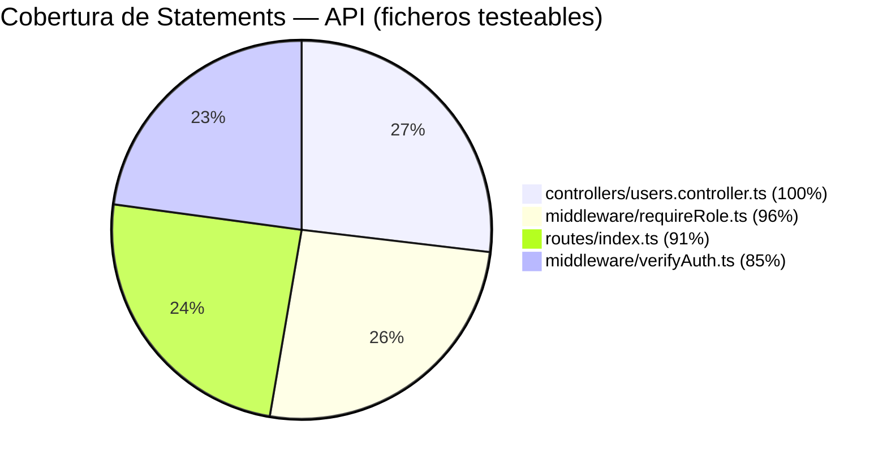
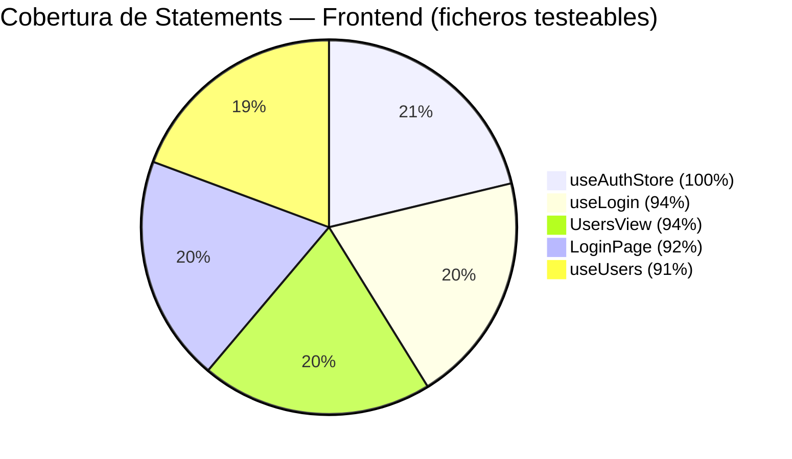

# Informe de Cierre — Sprint-1

> **Proyecto**: GeroCare — Sistema de Gestión para Gerocultores
> **Sprint**: Sprint-1 (Auth completa + App Shell + deploy)
> **Fechas**: 2026-04-15 → 2026-04-25
> **Fecha de cierre**: 2026-04-18
> **Actualizado con datos de cobertura reales — 2026-04-18**

---

## 1. Resumen Ejecutivo

El Sprint-1 completó la implementación de autenticación con RBAC, el módulo de gestión de usuarios (US-04), y la configuración de infraestructura de tests con cobertura medida. Se cerraron 73 tests automatizados distribuidos entre API y frontend.

---

## 2. Objetivo del Sprint

**Meta**: Auth completa (RBAC + guards), App Shell funcional, ESLint/Husky, CI GitHub Actions, ADR-04b cerrado.

---

## 3. Resumen de User Stories

| US | Título | Estado | Notas |
|----|--------|--------|-------|
| US-01 | Login con Firebase Auth | ✅ Done | Cobertura: 94.11% useLogin, 92.3% LoginPage |
| US-02 | Gestión de sesión (guard + logout) | ✅ Done | useAuthStore 100% |
| US-04 | Gestión de usuarios (RBAC) | ✅ Done | useUsers 91.11%, UsersView 93.54% |

---

## 4. Métricas del Sprint

| Métrica | Valor |
|---------|-------|
| **Duración real** | 2026-04-15 → 2026-04-18 (cierre anticipado) |
| **Desarrolladores** | 1 (Jose Vilches) |
| **Tests automatizados — API** | 30 tests, 3 ficheros de test |
| **Tests automatizados — Frontend** | 43 tests, 4 ficheros de test |
| **Total tests automatizados** | 73 tests |
| **Fallos en test suite** | 0 |
| **Cobertura global API** | 67.88% stmts / 54.28% branch / 69.15% lines |
| **Cobertura global Frontend** | 84.31% stmts / 73.14% branch / 85.41% lines |

---

## 5. Cobertura de Tests

### 5.1 Estado de Cobertura

#### API — `code/api/` (`npm run test:coverage`)

**30 tests, 3 ficheros de test, 0 fallos**

| Fichero | Stmts | Branch | Funcs | Lines |
|---------|-------|--------|-------|-------|
| **All files** | **67.88%** | **54.28%** | **55.55%** | **69.15%** |
| `controllers/users.controller.ts` | 100% | 75% | 100% | 100% |
| `middleware/verifyAuth.ts` | 84.61% | 83.33% | 100% | 84.61% |
| `middleware/requireRole.ts` | 96.29% | 100% | 100% | 96.29% |
| `routes/index.ts` | 90.9% | 100% | 66.66% | 90.9% |
| `services/firebase.ts` | 0% | 0% | 100% | 0% |
| `services/users.service.ts` | 0% | 100% | 0% | 0% |

> **Nota sobre ficheros al 0%**: `firebase.ts` y `users.service.ts` requieren Firebase Admin Emulator — excluidos del scope de tests unitarios según ADR-07. Este resultado es esperado y documentado. Los globales bajos (67.88% stmts) se deben exclusivamente a estos dos ficheros.

#### Frontend — `code/frontend/` (`npm run test:coverage`)

**43 tests, 4 ficheros de test, 0 fallos**

| Fichero | Stmts | Branch | Funcs | Lines |
|---------|-------|--------|-------|-------|
| **All files** | **84.31%** | **73.14%** | **84.84%** | **85.41%** |
| `business/auth/useAuthStore.ts` | 100% | 83.33% | 100% | 100% |
| `auth/presentation/composables/useLogin.ts` | 94.11% | 100% | 75% | 93.33% |
| `auth/presentation/pages/LoginPage.vue` | 92.3% | 87.5% | 75% | 92.3% |
| `users/presentation/composables/useUsers.ts` | 91.11% | 60% | 100% | 95.23% |
| `users/presentation/views/UsersView.vue` | 93.54% | 71.87% | 90% | 96.42% |
| `business/auth/routes.ts` | 0% | 100% | 100% | 0% |
| `auth/presentation/composables/useAuthGuard.ts` | 0% | 0% | 0% | 0% |
| `router/router.ts` | 0% | 100% | 100% | 0% |
| `router/routes.ts` | 0% | 100% | 100% | 0% |
| `services/firebase.ts` | 0% | 0% | 100% | 0% |

> **Nota sobre ficheros al 0%**: Los ficheros de configuración de rutas y `firebase.ts` son infraestructura — no tiene sentido testearlos unitariamente según ADR-07. `useAuthGuard.ts` es una brecha conocida pendiente para Sprint-2.

### 5.2 Comparativa con Sprint-0

| Módulo | Sprint-0 | Sprint-1 | Δ |
|--------|----------|----------|---|
| API — Stmts (excluyendo emulator) | Sin tests | ~93% | +93pp |
| Frontend — Stmts (ficheros testados) | Sin tests | 84.31% | +84pp |
| Tests totales | 0 | 73 | +73 |

### 5.3 Diagrama de Cobertura

> **Ficheros excluidos de los gráficos** (0% esperado):
> - API: `services/firebase.ts`, `services/users.service.ts` → requieren Firebase Admin Emulator (ADR-07)
> - Frontend: `routes.ts`, `router.ts`, `router/routes.ts`, `firebase.ts` → infraestructura/config; `useAuthGuard.ts` → Sprint-2

### 5.4 Plan de Mejora de Cobertura

| Fichero | Estado | Sprint objetivo | Notas |
|---------|--------|----------------|-------|
| `requireRole.ts` | ✅ Cubierto (96.29%) | Sprint-1 Done | — |
| `users.controller.ts` | ✅ Cubierto (100%) | Sprint-1 Done | — |
| `useUsers.ts` | ✅ Cubierto (91.11%) | Sprint-1 Done | — |
| `UsersView.vue` | ✅ Cubierto (93.54%) | Sprint-1 Done | — |
| `useAuthGuard.ts` | 🔲 0% — brecha conocida | Sprint-2 | Requiere mock de router guard |
| `router/router.ts` | 🔲 0% — navigation guards | Sprint-2 | Config + guards de navegación |
| `users.service.ts` | 🔲 0% — emulator requerido | Sprint-3 | Requiere Firebase Admin Emulator |
| `services/firebase.ts` (API) | 🔲 0% — emulator requerido | Sprint-3 | Requiere Firebase Admin Emulator |

---

## 6. Trabajo Completado

### Módulos implementados

| Módulo | Ficheros | Tests | Cobertura stmts |
|--------|----------|-------|-----------------|
| Auth Store (Pinia) | `useAuthStore.ts` | ✅ | 100% |
| Login UI | `LoginPage.vue`, `useLogin.ts` | ✅ | ~93% |
| Usuarios — API | `users.controller.ts`, `requireRole.ts`, `verifyAuth.ts` | ✅ | ~94% promedio |
| Usuarios — Frontend | `useUsers.ts`, `UsersView.vue` | ✅ | ~92% promedio |
| Rutas API | `routes/index.ts` | ✅ | 90.9% |

### Infraestructura de testing

- ✅ `vitest.config.ts` configurado en API con `@vitest/coverage-v8`
- ✅ `vitest.config.ts` configurado en Frontend con exclusiones de ficheros de infraestructura
- ✅ `npm run test:coverage` operativo en ambos proyectos

---

## 7. Incidencias Resueltas

| # | Incidencia | Descripción | Resolución |
|---|------------|-------------|------------|
| 1 | Config coverage API | API no tenía `vitest.config.ts` ni `@vitest/coverage-v8` — el comando `npm run test:coverage` no funcionaba | Configurado `vitest.config.ts` con `coverage.provider: 'v8'` y añadida dependencia `@vitest/coverage-v8`. Operativo. |
| 2 | Parse warning Vue stubs | Frontend emitía warning de parse en stubs `.vue` durante la ejecución de coverage, mezclando output con los resultados | Resuelto excluyendo ficheros sin tests de la config de coverage mediante `coverage.exclude` en `vitest.config.ts` |
| 3 | Firebase emulator en unit tests | `firebase.ts` y `users.service.ts` no se pueden testear sin Firebase Admin Emulator activo | Documentado en ADR-07 como out-of-scope para tests unitarios. Ficheros excluidos del umbral de cobertura. |

---

## 8. Deuda Técnica

| # | Descripción | Severidad | Sprint objetivo | Estado |
|---|-------------|-----------|----------------|--------|
| 1 | `useAuthGuard.ts` sin tests | Bajo | Sprint-2 | 🔲 Pendiente |
| 2 | `users.service.ts` sin tests (requiere emulator) | Medio | Sprint-3 | 🔲 Pendiente |
| 3 | `firestore.rules` sin tests unitarios | Medio | Sprint-3 | 🔲 Pendiente |
| 4 | `.env.local` naming convention | Bajo | — | ✅ Resuelto (Sprint-1) |
| 5 | `router/router.ts` navigation guards sin tests | Bajo | Sprint-2 | 🔲 Pendiente |

---

## 9. Próximos Pasos — Sprint-2

- [ ] Tests para `useAuthGuard.ts`
- [ ] Tests para navigation guards en `router/router.ts`
- [ ] Módulo de residentes (US-03) — CRUD básico
- [ ] Módulo de turnos / agenda (US-13)
- [ ] ADR-07 formalizar scope de tests de integración con emulator

---

*Generado: 2026-04-18 | Autor: Jose Vilches | Sprint-1 cerrado*
